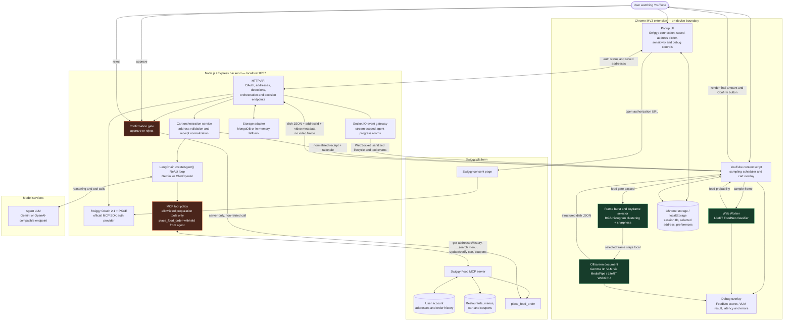

# CraveLens

**See it. Crave it. Get it.** CraveLens is a Chrome extension that recognizes food in YouTube videos on-device, identifies the dish with a local vision-language model, and asks a ReAct agent to prepare a personalized, discount-aware Swiggy cart. Nothing is ordered until the user explicitly confirms the final cart and payable amount.

## What it does

1. Samples frames from the active YouTube video without uploading them.
2. Runs a lightweight LiteRT FoodNet classifier to decide whether food is visible.
3. Selects a representative, sharp keyframe from a short frame burst.
4. Runs Gemma 3n locally with MediaPipe Tasks GenAI to identify the dish, cuisine, ingredients, confidence, and context.
5. Sends only the structured dish description, selected saved-address ID, and video metadata to the Node.js backend.
6. Runs a LangChain `createAgent()` ReAct loop with authenticated Swiggy MCP tools to inspect order history, search orderable menu items, respect observed dietary constraints, build the cart, and apply the best valid coupon.
7. Shows an itemized receipt and requires explicit confirmation before calling Swiggy's order tool.

## Architecture



### Trust and privacy boundaries

- Video pixels remain inside the extension. The server receives the VLM's structured description, not the keyframe.
- The ReAct agent receives only an allowlist of cart-preparation tools. It cannot call `place_food_order`.
- Order placement happens only after the user presses **Confirm** in the rendered receipt.
- `place_food_order` is never retried automatically because it is not idempotent.
- The payable total is read from the verified Swiggy cart and normalized with item discounts, coupons, taxes, fees, and delivery charges.
- The Builders Club ₹1,000 cart limit is checked before confirmation and again before ordering.

## Repository layout

```text
CraveLens/
├── apps/
│   ├── extension/       Chrome MV3 extension, local models and browser UI
│   ├── server/          Node.js API, OAuth, LangGraph agent and Swiggy adapter
│   └── web/             Vite-powered landing page
├── packages/
│   └── shared/          Shared Zod request and response contracts
├── .env.example         Server configuration template
└── package.json         npm workspace scripts
```

## Prerequisites

- Node.js 20 or newer
- npm
- Chrome or Chromium with WebGPU support
- A Swiggy account supported by the Swiggy MCP server
- A Gemini or OpenAI-compatible API key for the cart agent
- Optional: MongoDB for persistent detection and orchestration storage

## Local setup

```bash
npm install
cp .env.example .env
npm run build
npm run dev
```

Then:

1. Open `chrome://extensions`.
2. Enable **Developer mode**.
3. Choose **Load unpacked** and select `apps/extension/dist`.
4. Open the CraveLens popup and complete Swiggy sign-in.
5. Select a saved delivery address.
6. Open a YouTube video containing food and use **Scan current frame**, or allow continuous scanning.

During extension development, `npm run dev` watches and rebuilds the extension. Reload the unpacked extension from `chrome://extensions` after a rebuild. Restart the Node process after server changes.

## Local model setup

FoodNet and its LiteRT WASM runtime are bundled with the extension. Gemma 3n is served by the local backend and loaded into the extension for on-device inference.

1. Accept the Gemma model license.
2. Place the model at:

   ```text
   apps/server/models/gemma-3n-E2B-it-int4-Web.litertlm
   ```

3. Confirm availability:

   ```bash
   curl http://localhost:8787/api/local-model/status
   ```

See `apps/server/models/README.md` for model-specific notes. The browser must support WebGPU; first load can take time because the model is large.

## Configuration

| Variable | Required | Default | Purpose |
| --- | --- | --- | --- |
| `PORT` | No | `8787` | Express server port |
| `PUBLIC_BASE_URL` | Yes in production | `http://localhost:8787` | Public origin used for the OAuth callback |
| `LOCAL_MODEL_DIRECTORY` | No | Server model directory | Directory containing the Gemma LiteRT model |
| `AGENT_MODEL_PROVIDER` | Yes | `gemini` | `gemini` or `openai` |
| `AGENT_MODEL_NAME` | Yes | `gemini-2.5-flash` | Agent model name |
| `AGENT_MODEL_API_KEY` | Yes | — | Agent provider API key |
| `AGENT_MODEL_BASE_URL` | For custom OpenAI-compatible APIs | `https://api.openai.com/v1` | ChatOpenAI base URL |
| `MONGODB_URI` | No | — | Enables persistent storage when set |
| `MONGODB_DATABASE` | No | `cravelens` | MongoDB database name |
| `SWIGGY_FOOD_MCP_URL` | No | `https://mcp.swiggy.com/food` | Swiggy Food MCP endpoint |
| `SWIGGY_MCP_ACCESS_TOKEN` | No | — | Developer-only fallback; normal users use OAuth |
| `EXTENSION_ORIGIN` | No | `chrome-extension://*` | Allowed extension origin configuration |

For OpenAI:

```dotenv
AGENT_MODEL_PROVIDER=openai
AGENT_MODEL_NAME=gpt-4.1-mini
AGENT_MODEL_API_KEY=...
AGENT_MODEL_BASE_URL=https://api.openai.com/v1
```

## Swiggy OAuth flow

CraveLens uses OAuth 2.1 with PKCE through the official MCP SDK instead of implementing a custom token exchange in the extension.

1. The popup calls `POST /api/swiggy/auth/start`.
2. The backend performs MCP metadata discovery, dynamic client registration, and PKCE setup.
3. The popup opens the returned Swiggy consent URL.
4. Swiggy redirects to `http://localhost:8787/api/swiggy/auth/callback` during local development.
5. The backend completes authorization with the MCP transport and persists the session locally.
6. The popup polls the status endpoint and then loads saved addresses.

The extension stores only the opaque session identifier; it does not store the Swiggy access token. A 401 or 419 requires reauthorization. A deployed callback must use the configured HTTPS `PUBLIC_BASE_URL` and may require Swiggy allowlisting.

## Cart-agent workflow

The LangChain agent follows this sequence:

1. Verify the selected `addressId` using `get_addresses`.
2. Inspect order history and relevant order details for preferences and repeated safety constraints.
3. Search orderable menu items, including sensible synonyms when the literal dish name fails.
4. Select an open, serviceable restaurant and an exact variant/add-on configuration.
5. Update and re-read the cart to verify the chosen item.
6. Compare applicable COD-compatible coupons and apply the best valid offer.
7. Re-read the cart and return a concise rationale.
8. Normalize the actual restaurant, line items, savings, fees, taxes, and final payable amount for the confirmation UI.

The user—not the agent—decides whether to place the order.

## API overview

| Method | Endpoint | Description |
| --- | --- | --- |
| `GET` | `/health` | Service health check |
| `GET` | `/api/local-model/status` | Local Gemma model availability |
| `POST` | `/api/swiggy/auth/start` | Start OAuth/PKCE authorization |
| `GET` | `/api/swiggy/auth/status/:sessionId` | Poll authorization state |
| `GET` | `/api/swiggy/auth/callback` | OAuth redirect callback |
| `GET` | `/api/swiggy/addresses` | Load normalized saved addresses |
| `GET` | `/api/videos/:videoId/detections` | Read cached video detections |
| `POST` | `/api/videos/:videoId/detections` | Save a detection window |
| `POST` | `/api/orchestrate` | Build and verify a personalized cart |
| `POST` | `/api/orchestrate/:threadId/decision` | Approve or reject the prepared cart |

Authenticated Swiggy API requests carry the opaque session in the `x-swiggy-session-id` header.

## Storage

With `MONGODB_URI` configured, CraveLens stores:

- one cache document per YouTube video, with five-second fuzzy detection deduplication;
- orchestration threads with a 24-hour TTL index.

Without MongoDB, both stores fall back to process memory and are cleared when the server restarts. The selected address and extension preferences are cached locally in the browser.

## Debugging

Enable **Debug overlay** in the popup. The YouTube overlay reports:

- active video ID and timestamp;
- FoodNet scheduling, latency, and class probabilities;
- food-gate result;
- Gemma 3n dish, confidence, context, and inference time;
- cached detection windows;
- worker, model, messaging, and orchestration errors.

Useful checks:

```bash
curl http://localhost:8787/health
curl http://localhost:8787/api/local-model/status
npm test
npm run typecheck
```

Agent progress is logged by the server as `[agent:<run-id>]`, including tool start/completion, duration, and sanitized arguments.

While orchestration is running, the extension also opens a Socket.IO WebSocket and subscribes to a UUID-scoped room before sending the cart request. The server streams sanitized lifecycle and MCP tool events to that room, allowing the loading card to show live address, history, menu, cart, coupon, and verification progress. The socket closes when the cart is ready or the run fails; cart confirmation continues to use the explicit HTTP decision endpoint.

## Scripts

| Command | Description |
| --- | --- |
| `npm run dev` | Watch the server and extension |
| `npm run build` | Build/check shared, server, and extension workspaces |
| `npm run dev:web` | Run the landing page |
| `npm run build:web` | Build the landing page |
| `npm test` | Run server tests |
| `npm run typecheck` | Syntax/type checks across workspaces |

## Current constraints

- Food recognition quality depends on the visible frame and local model confidence.
- Gemma inference requires a capable WebGPU device and sufficient memory.
- Swiggy MCP client availability and account eligibility are controlled by Swiggy.
- Checkout currently follows the payment methods returned by the verified Swiggy cart and the Builders Club ordering constraints.
- This is an experimental ordering assistant; always review the restaurant, address, items, dietary implications, and final amount before confirming.
