# CraveLens

**See it. Crave it. Get it.** CraveLens is a Chrome extension that recognizes food in supported videos and user-selected page regions on-device, identifies the dish with a local vision-language model, and asks a ReAct agent to prepare a personalized, discount-aware Swiggy cart. It can auto-detect on YouTube, Instagram Reels, and Facebook videos, or use a keyboard-triggered rectangular lasso on any normal webpage. Nothing is ordered until the user explicitly confirms the final cart and payable amount.

[](https://youtu.be/CBFwNSKmt8o)

## What it does

1. Samples frames from the active YouTube, Instagram, or Facebook video without uploading them, or captures only the user-selected lasso rectangle from the active tab.
2. Runs the bundled `best_dynamic.onnx` YOLO food detector in an ONNX Runtime Web Worker. Only detector-positive frames proceed to the more expensive VLM stage.
3. Selects a representative, sharp keyframe from a short frame burst.
4. Runs the configured local VLM—Gemini Nano, browser-downloaded Gemma 3n, or an Ollama vision model—to return an `isFood` verdict plus the dish, cuisine, ingredients, confidence, and context.
5. Continues only when the configured VLM returns valid structured JSON, `isFood: true`, and confidence of at least 0.65. Failed, malformed, non-food, and low-confidence responses do not show a craving prompt or create a cart.
6. Records the confirmed dish, frame timestamp or page-selection timestamp, and visual signature in per-source `localStorage` history to suppress repeated scenes, duplicate dishes, unnecessary VLM work, and duplicate carts.
7. Sends only the structured dish description, selected saved-address ID, and source metadata to the Node.js backend.
8. Runs a LangChain `createAgent()` ReAct loop with authenticated Swiggy MCP tools to inspect order history, search orderable menu items, respect observed dietary constraints, build the cart, and apply the best valid coupon.
9. Saves prepared carts in a collapsible source-aware cart shelf and shows an itemized receipt with dietary markers, available item imagery, descriptions, and an explicit confirmation step before calling Swiggy's order tool.

## Architecture

```mermaid
flowchart TB
  User([User watching or browsing])

  subgraph Chrome["Chrome MV3 extension — on-device boundary"]
    direction TB
    Popup["Popup UI<br/>Swiggy connection, saved-address picker,<br/>shortcut, per-site auto-detection and debug controls"]
    Background["Background service worker<br/>API proxy, keyboard command,<br/>visible-tab lasso capture and offscreen document lifecycle"]
    Content["Content script<br/>video scheduler, lasso selector,<br/>detector canvas, craving prompt and cart shelf"]
    Offscreen["Offscreen document<br/>local inference coordinator"]
    Worker["Module Web Worker<br/>best_dynamic.onnx via ONNX Runtime WASM<br/>YOLO decode + NMS"]
    Burst["Frame burst and keyframe selector<br/>RGB histogram clustering + sharpness"]
    VLM["Gemini Nano / Gemma 3n / Ollama VLM<br/>Browser-local verification"]
    Gate{"Valid JSON?<br/>isFood = true?<br/>confidence ≥ 0.65?"}
    History[("Browser localStorage<br/>per-source confirmed dishes,<br/>timestamps and signatures")]
    Carts[("Browser sessionStorage<br/>per-tab prepared carts,<br/>payment state and shelf state")]
    Debug["Debug UI<br/>ONNX boxes and confidence,<br/>VLM isFood verdict, latency and errors"]
    LocalPrefs[("Chrome storage<br/>device tokens, selected address,<br/>preferences, model settings and debug setting")]
    ModelCache[("Browser Cache Storage<br/>downloaded LiteRT / Gemma 3n model bytes")]

    Content -->|"sample video frame or selected page region"| Background
    Background --> Offscreen
    Offscreen --> Worker
    Worker -->|"food boxes + confidence"| Offscreen
    Offscreen -->|"detector result"| Background
    Background --> Content
    Content -->|"debug mode: draw temporary boxes"| Debug
    Content -->|"detector-positive: check timestamp / signature"| History
    History -->|"new scene"| Burst
    History -->|"known scene: skip verification"| Content
    Burst -->|"selected frame stays local"| Background
    Background -->|"verification request"| Offscreen
    Offscreen --> VLM
    VLM -->|"structured verification JSON"| Gate
    Gate -->|"confirmed food only"| Content
    Gate -->|"failed / invalid / rejected: stop silently"| Debug
    Content -->|"deduplicate dish and persist confirmation"| History
    Content -->|"persist prepared cart / payment state"| Carts
    Carts -->|"restore cart shelf in this tab"| Content
    Content --> Debug
    VLM --> Debug
    Popup <--> Background
    Content <--> Background
    Popup <--> LocalPrefs
    Content <--> LocalPrefs
    Offscreen <--> ModelCache
  end

  subgraph API["Node.js / Express backend — localhost:8787"]
    direction TB
    Routes["HTTP API<br/>OAuth, addresses, detections,<br/>orchestration and decision endpoints"]
    Events["Socket.IO event gateway<br/>stream-scoped agent progress rooms"]
    Inference["Socket.IO /inference namespace<br/>authenticated browser model bridge"]
    OAuth["Swiggy OAuth 2.1 + PKCE<br/>official MCP SDK auth provider"]
    Orchestrator["Cart orchestration service<br/>address validation, customization,<br/>deterministic edits and receipt normalization"]
    Agent["LangChain createAgent() ReAct loop<br/>local browser model or hosted fallback"]
    ToolPolicy["MCP tool policy<br/>allowlisted preparation tools only<br/>place_food_order withheld from agent"]
    Decision["Confirmation and payment gate<br/>reject, COD order or UPI handoff"]
    Store["Storage adapters<br/>MongoDB app data + Redis sessions, credentials,<br/>settings and inference routing"]

    Routes --> OAuth
    Routes --- Events
    Routes --- Inference
    Routes --> Orchestrator
    Orchestrator --> Agent
    Agent --> ToolPolicy
    Routes <--> Store
    Inference <--> Store
    Routes --> Decision
  end

  subgraph Swiggy["Swiggy platform"]
    direction TB
    Consent["Swiggy consent page"]
    MCP["Swiggy Food MCP server"]
    Account[("User account<br/>addresses and order history")]
    Catalog[("Restaurants, menus,<br/>cart and coupons")]
    Order["place_food_order"]
    Payment["UPI payment lifecycle<br/>QR, status and confirm_order"]

    Consent --> OAuth
    MCP <--> Account
    MCP <--> Catalog
    MCP --> Order
    Order --> Payment
  end

  subgraph Models["Model services"]
    BrowserLLM["Browser-hosted orchestration LLM<br/>LiteRT Gemma 4 or Ollama"]
    AgentModel["Optional hosted fallback/default<br/>Gemini or OpenAI-compatible endpoint"]
    Langfuse["Optional Langfuse<br/>agent trace export"]
  end

  User --> Popup
  User --> Content
  Popup -->|"open authorization URL"| Consent
  Background <-->|"auth, settings and orchestration HTTP"| Routes
  Background <-->|"authenticated local inference requests"| Inference
  Inference <-->|"model calls, chunks, results and cancellation"| BrowserLLM
  BrowserLLM -.->|"runs in extension / Ollama, not tunnelled"| Offscreen
  Content -->|"VLM-confirmed dish JSON + addressId + source metadata<br/>no frame or lasso image"| Background
  Events -->|"WebSocket: sanitized lifecycle and tool events"| Content
  Agent <-->|"reasoning and tool calls"| Inference
  Agent <-->|"hosted default or approved fallback"| AgentModel
  Agent -.->|"when configured"| Langfuse
  ToolPolicy <-->|"get addresses/history, search menu,<br/>update/verify cart, coupons"| MCP
  Orchestrator -->|"normalized receipt + rationale"| Content
  Content -->|"persist cart and render shelf / full prompt"| Carts
  Content -->|"render final amount, Why this cart? and Confirm button"| User
  User -->|"approve COD / UPI"| Decision
  Decision -->|"server-only, non-retried placement"| Order
  Decision <-->|"poll / cancel / confirm paid order"| Payment
  User -->|"reject"| Decision

  classDef local fill:#173d2b,stroke:#55c98a,color:#fff
  classDef safety fill:#4a251b,stroke:#ff7043,color:#fff
  class Offscreen,Worker,VLM,Burst,ModelCache,BrowserLLM local
  class ToolPolicy,Decision safety
```



### Trust and privacy boundaries

- Video pixels and lasso screenshots remain inside the extension. The server receives the VLM's structured description, not the keyframe or selected image.
- The ReAct agent receives only an allowlist of cart-preparation tools. It cannot call `place_food_order`.
- Order placement happens only after the user presses **Confirm** in the rendered receipt.
- `place_food_order` is never retried automatically because it is not idempotent.
- The payable total is read from the verified Swiggy cart and normalized with item discounts, coupons, taxes, fees, and delivery charges.
- The Builders Club ₹1,000 cart limit is checked before confirmation and again before ordering.

## Repository layout

```text
CraveLens/
├── apps/
│   ├── extension/       Chrome MV3 extension, local models and browser UI
│   ├── server/          Node.js API, OAuth, LangGraph agent and Swiggy adapter
│   └── web/             Vite-powered landing page
├── packages/
│   └── shared/          Shared Zod request and response contracts
├── .env.example         Server configuration template
└── package.json         npm workspace scripts
```

## Prerequisites

- Node.js 20 or newer
- npm
- Chrome or Chromium with WebGPU support
- A Swiggy account supported by the Swiggy MCP server
- Optional: a Gemini or OpenAI-compatible API key for hosted orchestration defaults or approved local fallback
- Optional: MongoDB for persistent detection and orchestration storage
- Redis for device sessions, encrypted credentials, settings, and browser-inference routing

## Local setup

```bash
npm install
cp .env.example .env
npm run build
npm run dev
```

Then:

1. Open `chrome://extensions`.
2. Enable **Developer mode**.
3. Choose **Load unpacked** and select `apps/extension/dist`.
4. Open the CraveLens popup and complete Swiggy sign-in.
5. Select a saved delivery address.
6. Open a supported video page, such as YouTube, Instagram Reels, or Facebook Watch/video, and use **Scan current frame** (`Ctrl+Shift+Y`) to send the current frame directly to the configured VLM, bypassing the scheduled ONNX gate, or allow continuous ONNX-gated scanning.
7. On other webpages, use the same keyboard shortcut to draw a rectangular lasso around visible food. Only the selected area is captured and checked.

During extension development, `npm run dev` watches and rebuilds the extension. Reload the unpacked extension from `chrome://extensions` after a rebuild. Restart the Node process after server changes.

## Local model setup

The YOLO food detector and ONNX Runtime WASM are bundled with the extension. The detector model is located at:

```text
apps/extension/public/models/food-detector/best_dynamic.onnx
```

It accepts a dynamic `[1, 3, 640, 640]` tensor and produces `[1, 5, 8400]` detections. Frames are letterboxed before inference; decoded boxes are mapped back onto supported videos when debug mode is enabled.

Gemma 3n VLM verification does not need a server-installed model: selecting Gemma 3n downloads `gemma-3n-E2B-it-int4-Web.litertlm` directly from Google's Hugging Face repo into the extension's browser cache and runs it locally with WebGPU. For orchestration, selecting LiteRT downloads the chosen supported Gemma 4 text model directly into the browser cache after Settings are saved: E2B (1.9 GB), E4B (2.8 GB), 12B (5.6 GB), 26B A4B (14.7 GB), or 31B (17.9 GB). The browser-downloaded model bytes do not pass through the CraveLens server.

Server-installed Gemma 4 E2B/E4B VLM `.task` artifacts are temporarily hidden from the VLM Settings UI. `apps/server/models` remains available for those optional artifacts when this path is re-enabled. The browser must support WebGPU; first load can take time because the model is large.

### Docker Compose

The repository Compose file runs MongoDB, `redis:8.8.1-alpine`, and the published CraveLens server image. Redis is private to the Compose network, password protected, health checked, and persisted with append-only storage.

After creating `.env`, start the services with:

```bash
docker compose up -d
```

The host directory `./apps/server/models` is mounted read-only at `/app/apps/server/models` in the server container.

## Configuration

| Variable | Required | Default | Purpose |
| --- | --- | --- | --- |
| `PORT` | No | `8787` | Express server port |
| `PUBLIC_BASE_URL` | Yes in production | `http://localhost:8787` | Public origin used for the OAuth callback |
| `LOCAL_MODEL_DIRECTORY` | No | Server model directory | Optional directory for server-hosted model artifacts; normal Gemma 3n/LiteRT downloads are browser-cache based |
| `REDIS_URL` | Yes | `redis://localhost:6379/0` | Redis used for device sessions, encrypted OAuth/BYOK, settings and Socket.IO routing |
| `CREDENTIAL_ENCRYPTION_KEY` | Yes | — | 32-byte hex/base64 AES-256-GCM envelope-encryption key |
| `DEVICE_SESSION_SIGNING_KEY` | Yes | — | Signs 15-minute extension device access tokens |
| `AGENT_MODEL_PROVIDER` | Yes | `gemini` | `gemini` or `openai` |
| `AGENT_MODEL_NAME` | Yes | `gemini-2.5-flash` | Agent model name |
| `AGENT_MODEL_API_KEY` | Yes | — | Agent provider API key |
| `AGENT_MODEL_BASE_URL` | For custom OpenAI-compatible APIs | `https://api.openai.com/v1` | ChatOpenAI base URL |
| `OLLAMA_BASE_URL` | No | `http://localhost:11434` | Default Ollama origin shown to extension users; each device may override it |
| `LANGFUSE_PUBLIC_KEY` | No | — | Enables Langfuse tracing when paired with the secret key |
| `LANGFUSE_SECRET_KEY` | No | — | Enables Langfuse tracing when paired with the public key |
| `LANGFUSE_BASE_URL` | No | `https://cloud.langfuse.com` | Langfuse Cloud region or self-hosted instance |
| `LANGFUSE_TRACING_ENVIRONMENT` | No | `development` | Environment label applied to Langfuse traces |
| `MONGODB_URI` | No | — | Enables persistent storage when set |
| `MONGODB_DATABASE` | No | `cravelens` | MongoDB database name |
| `SWIGGY_FOOD_MCP_URL` | No | `https://mcp.swiggy.com/food` | Swiggy Food MCP endpoint |
| `SWIGGY_MCP_ACCESS_TOKEN` | No | — | Developer-only fallback; normal users use OAuth |

For OpenAI:

```dotenv
AGENT_MODEL_PROVIDER=openai
AGENT_MODEL_NAME=gpt-4.1-mini
AGENT_MODEL_API_KEY=...
AGENT_MODEL_BASE_URL=https://api.openai.com/v1
```

### Langfuse observability

Langfuse tracing is optional and runs only when both credentials are present:

```dotenv
LANGFUSE_PUBLIC_KEY=pk-lf-...
LANGFUSE_SECRET_KEY=sk-lf-...
LANGFUSE_BASE_URL=https://cloud.langfuse.com
LANGFUSE_TRACING_ENVIRONMENT=development
```

Each Swiggy agent invocation is sent through Langfuse's LangChain callback handler, including nested model and tool observations, latency, outputs, and errors. Runs are grouped by the cart conversation ID. The server initializes the OpenTelemetry exporter at startup and flushes it during graceful shutdown. If either credential is missing or initialization fails, the agent runs normally without Langfuse.

## Swiggy OAuth flow

CraveLens uses OAuth 2.1 with PKCE through the official MCP SDK instead of implementing a custom token exchange in the extension.

1. The popup calls `POST /api/swiggy/auth/start`.
2. The backend performs MCP metadata discovery, dynamic client registration, and PKCE setup.
3. The popup opens the returned Swiggy consent URL.
4. Swiggy redirects to `http://localhost:8787/api/swiggy/auth/callback` during local development.
5. The backend atomically consumes OAuth `state`, completes authorization, and stores the credential encrypted in Redis with the provider expiry.
6. The popup polls the status endpoint and then loads saved addresses.

The extension stores a rotating CraveLens device refresh token and keeps its 15-minute access token in `chrome.storage.session`; it never receives the Swiggy access token. Existing filesystem-backed sessions require a one-time reconnection. A deployed callback uses the fixed HTTPS `PUBLIC_BASE_URL` callback and may require Swiggy allowlisting.

### Local models and Ollama

The extension initiates an authenticated `/inference` WebSocket connection to the server. The server-side `RemoteBrowserChatModel` invokes LiteRT or Ollama through that connection; neither an Ollama endpoint nor a browser model is tunnelled or exposed publicly. The Settings page starts with `OLLAMA_BASE_URL` (default `http://localhost:11434`), lets the user override it per device, and immediately probes `/api/tags` and `/api/show`. A non-default host requires a one-time Chrome host-permission grant when **Test** is clicked. The configured Ollama service must allow this unpacked extension's exact `chrome-extension://<extension-id>` origin, for example `OLLAMA_ORIGINS=chrome-extension://<extension-id>`, before Ollama is restarted. Do not expose an unauthenticated Ollama service to the public internet.

For hosted orchestration, `AGENT_MODEL_PROVIDER` selects the single server default (`gemini` or `openai`). In the extension, choose the matching Google Gemini or OpenAI-compatible entry and leave model, URL, and key blank to use that deployment configuration. A key entered in Settings is encrypted in Redis and takes precedence for that device; the inactive hosted provider requires such a user override. Hosted fallback from a local provider always requires explicit approval.

For managed deployments use a TLS Redis URL and store the encryption/signing keys in the platform secret manager. Rotate an encryption key by decrypting with the old key and re-encrypting each credential before removing it. Local-model Langfuse traces are metadata-only unless `LANGFUSE_LOCAL_CONTENT=true` is explicitly enabled.

## Cart-agent workflow

The LangChain agent follows this sequence:

1. Verify the selected `addressId` using `get_addresses`.
2. Inspect order history and relevant order details for preferences and repeated safety constraints.
3. Search orderable menu items, including sensible synonyms when the literal dish name fails.
4. Select an open, serviceable restaurant and an exact variant/add-on configuration.
5. Update and re-read the cart to verify the chosen item.
6. Prefer the best payment-method-neutral coupon so the user can choose COD or UPI at confirmation.
7. Re-read the cart and return a concise rationale.
8. Normalize the actual restaurant, line items, savings, fees, taxes, and final payable amount for the confirmation UI.

The user—not the agent—decides whether to place the order.

## API overview

| Method | Endpoint | Description |
| --- | --- | --- |
| `GET` | `/health` | Service health check |
| `GET` | `/api/local-model/status` | Optional server-hosted local model artifact availability |
| `POST` | `/api/device/session` | Bootstrap a signed device session |
| `POST` | `/api/device/session/refresh` | Rotate a device refresh token |
| `GET` | `/models/:file` | Optional static server-hosted model artifact endpoint; hidden from the normal VLM Settings path |
| `POST` | `/api/swiggy/auth/start` | Start OAuth/PKCE authorization |
| `GET` | `/api/swiggy/auth/status` | Poll authorization state for the authenticated device |
| `GET` | `/api/swiggy/auth/callback` | OAuth redirect callback |
| `GET` | `/api/swiggy/addresses` | Load normalized saved addresses |
| `GET/PUT` | `/api/model-settings` | Read/update VLM and orchestration providers without returning secrets |
| `GET` | `/api/videos/:videoId/detections` | Read cached source detections |
| `POST` | `/api/orchestrate` | Build and verify a personalized cart |
| `POST` | `/api/orchestrate/:threadId/customize` | Continue the cart-agent conversation with a free-form instruction |
| `GET` | `/api/orchestrate/:threadId/menu` | Browse or search the prepared cart's restaurant menu |
| `POST` | `/api/orchestrate/:threadId/cart` | Add, remove, or change the quantity of verified cart items |
| `POST` | `/api/orchestrate/:threadId/coupon` | Apply a selected eligible coupon and refresh the receipt |
| `POST` | `/api/orchestrate/:threadId/decision` | Reject a cart or approve it with `COD`/`UPI` |
| `GET` | `/api/orchestrate/:threadId/payment-status` | Poll a pending UPI payment |
| `POST` | `/api/orchestrate/:threadId/cancel-payment` | Stop a still-pending UPI flow after re-checking its status |
| `POST` | `/api/orchestrate/:threadId/confirm-payment` | Finalize a successfully paid UPI order |
| `POST` | `/api/videos/:videoId/detections` | Save a detection window |

Authenticated APIs use a short-lived `Authorization: Bearer <device-access-token>` header. Redis stores only hashes of rotating refresh tokens.

## Storage

With `MONGODB_URI` configured, CraveLens stores:

- one cache document per supported source ID, with five-second fuzzy detection deduplication;
- orchestration threads with a 24-hour TTL index, including short-lived pending UPI references while a payment is in progress.

Without MongoDB, both server stores fall back to process memory and are cleared when the server restarts.

The browser additionally stores the following per supported video or selected page source in `localStorage`:

- VLM-confirmed dish names, normalized deduplication keys, confidence, and frame timestamps;
- compact frame histogram signatures used to avoid repeated VLM verification of the same scene.

Prepared cart suggestions, their ready/ordered state, and whether the source-aware cart shelf is hidden or visible are stored in per-tab `sessionStorage`. Cart suggestions include a 10-minute `expiresAt`; expired suggestions are removed from the client shelf and rejected by the server before order placement.

Device-session tokens, selected address, extension preferences, model settings, detector sensitivity, keyboard shortcut behavior, per-site auto-detection settings, and debug setting are cached in extension storage for background and content-script reads. Swiggy OAuth credentials and BYOK provider keys stay server-side, encrypted in Redis.

## Debugging

Enable **Debug overlay** in the popup. The source-aware overlay reports:

- active source ID and timestamp;
- ONNX detector scheduling and inference latency;
- detector boxes, labels, and confidence scores;
- temporary bounding boxes drawn over supported videos and removed when stale, paused, seeking, ended, or disabled;
- Configured VLM `isFood` verdict, dish, confidence, context, and inference time;
- confirmed-food history and prepared-cart counts;
- worker, model, messaging, and orchestration errors.

Useful checks:

```bash
curl http://localhost:8787/health
npm test
npm run typecheck
```

Agent progress is logged by the server as `[agent:<run-id>]`, including tool start/completion, duration, and sanitized arguments.

While orchestration is running, the extension also opens a Socket.IO WebSocket and subscribes to a UUID-scoped room before sending the cart request. The server streams sanitized lifecycle and MCP tool events to that room, allowing the loading card to show live address, history, menu, cart, coupon, and verification progress. The generated-cart popup accepts follow-up instructions and sends them through the same application thread UUID, which is also used as LangGraph's checkpointed `thread_id`; the verified receipt is then refreshed in place. The socket closes when the cart is ready or the run fails; cart confirmation continues to use the explicit HTTP decision endpoint.

## Scripts

| Command | Description |
| --- | --- |
| `npm run dev` | Watch the server and extension |
| `npm run build` | Build/check shared, server, and extension workspaces |
| `npm run dev:web` | Run the landing page |
| `npm run build:web` | Build the landing page |
| `npm test` | Run server tests |
| `npm run typecheck` | Syntax/type checks across workspaces |

## Current constraints

- Food recognition quality depends on the visible frame and local model confidence.
- The ONNX detector is a preliminary gate; only configured-VLM-confirmed food at confidence 0.65 or higher can create a craving prompt or cart.
- Auto-detection currently targets YouTube, Instagram Reels, and Facebook Watch/video pages. Other webpages use the keyboard-triggered lasso selector.
- Per-source history is local to the current browser origin/profile and can be cleared with browser site data.
- Browser-local VLM and LiteRT inference require a capable WebGPU device and sufficient memory; Ollama models require a reachable local Ollama service.
- Swiggy MCP client availability and account eligibility are controlled by Swiggy.
- Checkout shows the live COD and UPI methods returned by Swiggy. UPI orders use Swiggy's QR handoff, payment-status polling, optional mid-flow cancellation, and one-time confirmation flow; availability remains account/cart dependent.
- This is an experimental ordering assistant; always review the restaurant, address, items, dietary implications, and final amount before confirming.
