# CraveLens

**See it. Crave it. Get it.** CraveLens is a Chrome extension that recognizes food in YouTube videos on-device, identifies the dish with a local vision-language model, and asks a ReAct agent to prepare a personalized, discount-aware Swiggy cart. Nothing is ordered until the user explicitly confirms the final cart and payable amount.

## What it does

1. Samples frames from the active YouTube video without uploading them.
2. Runs the bundled `best_dynamic.onnx` YOLO food detector in an ONNX Runtime Web Worker. Only detector-positive frames proceed to the more expensive VLM stage.
3. Selects a representative, sharp keyframe from a short frame burst.
4. Runs Gemma 3n locally with MediaPipe Tasks GenAI to return an `isFood` verdict plus the dish, cuisine, ingredients, confidence, and context.
5. Continues only when Gemma returns valid structured JSON, `isFood: true`, and confidence of at least 0.65. Failed, malformed, non-food, and low-confidence responses do not show a craving prompt or create a cart.
6. Records the confirmed dish, frame timestamp, and visual signature in per-video `localStorage` history to suppress repeated scenes, duplicate dishes, unnecessary VLM work, and duplicate carts.
7. Sends only the structured dish description, selected saved-address ID, and video metadata to the Node.js backend.
8. Runs a LangChain `createAgent()` ReAct loop with authenticated Swiggy MCP tools to inspect order history, search orderable menu items, respect observed dietary constraints, build the cart, and apply the best valid coupon.
9. Saves prepared carts in a collapsible per-video cart shelf and shows an itemized receipt with dietary markers, available item imagery, descriptions, and an explicit confirmation step before calling Swiggy's order tool.

## Architecture

```mermaid
flowchart TB
  User([User watching YouTube])

  subgraph Chrome["Chrome MV3 extension — on-device boundary"]
    direction TB
    Popup["Popup UI<br/>Swiggy connection, saved-address picker,<br/>sensitivity and debug controls"]
    Background["Background service worker<br/>API proxy, keyboard command,<br/>offscreen document lifecycle"]
    Content["YouTube content script<br/>sampling scheduler, detector canvas,<br/>craving prompt and cart shelf"]
    Offscreen["Offscreen document<br/>local inference coordinator"]
    Worker["Module Web Worker<br/>best_dynamic.onnx via ONNX Runtime WASM<br/>YOLO decode + NMS"]
    Burst["Frame burst and keyframe selector<br/>RGB histogram clustering + sharpness"]
    VLM["Gemma 3n VLM<br/>MediaPipe Tasks GenAI / WebGPU"]
    Gate{"Valid JSON?<br/>isFood = true?<br/>confidence ≥ 0.65?"}
    History[("YouTube localStorage<br/>per-video confirmed dishes,<br/>timestamps and signatures")]
    Carts[("YouTube sessionStorage<br/>per-tab prepared carts,<br/>payment state and shelf state")]
    Debug["Debug UI<br/>ONNX boxes and confidence,<br/>Gemma isFood verdict, latency and errors"]
    LocalPrefs[("Chrome storage<br/>session ID, selected address,<br/>preferences and debug setting")]

    Content -->|"sample frame"| Background
    Background --> Offscreen
    Offscreen --> Worker
    Worker -->|"food boxes + confidence"| Offscreen
    Offscreen -->|"detector result"| Background
    Background --> Content
    Content -->|"debug mode: draw temporary boxes"| Debug
    Content -->|"detector-positive: check timestamp / signature"| History
    History -->|"new scene"| Burst
    History -->|"known scene: skip verification"| Content
    Burst -->|"selected frame stays local"| Background
    Background -->|"verification request"| Offscreen
    Offscreen --> VLM
    VLM -->|"structured verification JSON"| Gate
    Gate -->|"confirmed food only"| Content
    Gate -->|"failed / invalid / rejected: stop silently"| Debug
    Content -->|"deduplicate dish and persist confirmation"| History
    Content -->|"persist prepared cart / payment state"| Carts
    Carts -->|"restore cart shelf in this tab"| Content
    Content --> Debug
    VLM --> Debug
    Popup <--> Background
    Content <--> Background
    Popup <--> LocalPrefs
    Content <--> LocalPrefs
  end

  subgraph API["Node.js / Express backend — localhost:8787"]
    direction TB
    Routes["HTTP API<br/>OAuth, addresses, detections,<br/>orchestration and decision endpoints"]
    Events["Socket.IO event gateway<br/>stream-scoped agent progress rooms"]
    ModelHost["Static local-model endpoint<br/>Gemma LiteRT model"]
    OAuth["Swiggy OAuth 2.1 + PKCE<br/>official MCP SDK auth provider"]
    Orchestrator["Cart orchestration service<br/>address validation, customization,<br/>deterministic edits and receipt normalization"]
    Agent["LangChain createAgent() ReAct loop<br/>Gemini or ChatOpenAI"]
    ToolPolicy["MCP tool policy<br/>allowlisted preparation tools only<br/>place_food_order withheld from agent"]
    Decision["Confirmation and payment gate<br/>reject, COD order or UPI handoff"]
    Store["Storage adapter<br/>MongoDB or in-memory fallback"]

    Routes --> OAuth
    Routes --- Events
    Routes --- ModelHost
    Routes --> Orchestrator
    Orchestrator --> Agent
    Agent --> ToolPolicy
    Routes <--> Store
    Routes --> Decision
  end

  subgraph Swiggy["Swiggy platform"]
    direction TB
    Consent["Swiggy consent page"]
    MCP["Swiggy Food MCP server"]
    Account[("User account<br/>addresses and order history")]
    Catalog[("Restaurants, menus,<br/>cart and coupons")]
    Order["place_food_order"]
    Payment["UPI payment lifecycle<br/>QR, status and confirm_order"]

    Consent --> OAuth
    MCP <--> Account
    MCP <--> Catalog
    MCP --> Order
    Order --> Payment
  end

  subgraph Models["Model services"]
    AgentModel["Agent LLM<br/>Gemini or OpenAI-compatible endpoint"]
    Langfuse["Optional Langfuse<br/>agent trace export"]
  end

  User --> Popup
  User --> Content
  Popup -->|"open authorization URL"| Consent
  Background <-->|"auth, model and orchestration HTTP"| Routes
  ModelHost -->|"Gemma model bytes"| VLM
  Content -->|"VLM-confirmed dish JSON + addressId + video metadata<br/>no video frame"| Background
  Events -->|"WebSocket: sanitized lifecycle and tool events"| Content
  Agent <-->|"reasoning and tool calls"| AgentModel
  Agent -.->|"when configured"| Langfuse
  ToolPolicy <-->|"get addresses/history, search menu,<br/>update/verify cart, coupons"| MCP
  Orchestrator -->|"normalized receipt + rationale"| Content
  Content -->|"persist cart and render shelf / full prompt"| Carts
  Content -->|"render final amount, Why this cart? and Confirm button"| User
  User -->|"approve COD / UPI"| Decision
  Decision -->|"server-only, non-retried placement"| Order
  Decision <-->|"poll / cancel / confirm paid order"| Payment
  User -->|"reject"| Decision

  classDef local fill:#173d2b,stroke:#55c98a,color:#fff
  classDef safety fill:#4a251b,stroke:#ff7043,color:#fff
  class Offscreen,Worker,VLM,Burst local
  class ToolPolicy,Decision safety
```



### Trust and privacy boundaries

- Video pixels remain inside the extension. The server receives the VLM's structured description, not the keyframe.
- The ReAct agent receives only an allowlist of cart-preparation tools. It cannot call `place_food_order`.
- Order placement happens only after the user presses **Confirm** in the rendered receipt.
- `place_food_order` is never retried automatically because it is not idempotent.
- The payable total is read from the verified Swiggy cart and normalized with item discounts, coupons, taxes, fees, and delivery charges.
- The Builders Club ₹1,000 cart limit is checked before confirmation and again before ordering.

## Repository layout

```text
CraveLens/
├── apps/
│   ├── extension/       Chrome MV3 extension, local models and browser UI
│   ├── server/          Node.js API, OAuth, LangGraph agent and Swiggy adapter
│   └── web/             Vite-powered landing page
├── packages/
│   └── shared/          Shared Zod request and response contracts
├── .env.example         Server configuration template
└── package.json         npm workspace scripts
```

## Prerequisites

- Node.js 20 or newer
- npm
- Chrome or Chromium with WebGPU support
- A Swiggy account supported by the Swiggy MCP server
- A Gemini or OpenAI-compatible API key for the cart agent
- Optional: MongoDB for persistent detection and orchestration storage

## Local setup

```bash
npm install
cp .env.example .env
npm run build
npm run dev
```

Then:

1. Open `chrome://extensions`.
2. Enable **Developer mode**.
3. Choose **Load unpacked** and select `apps/extension/dist`.
4. Open the CraveLens popup and complete Swiggy sign-in.
5. Select a saved delivery address.
6. Open a YouTube video or Short containing food and use **Scan current frame** (`Ctrl+Shift+Y`) to send the frame directly to Gemma 3n, bypassing the scheduled ONNX gate, or allow continuous ONNX-gated scanning.

During extension development, `npm run dev` watches and rebuilds the extension. Reload the unpacked extension from `chrome://extensions` after a rebuild. Restart the Node process after server changes.

## Local model setup

The YOLO food detector and ONNX Runtime WASM are bundled with the extension. The detector model is located at:

```text
apps/extension/public/models/food-detector/best_dynamic.onnx
```

It accepts a dynamic `[1, 3, 640, 640]` tensor and produces `[1, 5, 8400]` detections. Frames are letterboxed before inference; decoded boxes are mapped back onto the YouTube video when debug mode is enabled.

Gemma 3n is served by the local backend and loaded into the extension for on-device verification.

1. Accept the Gemma model license.
2. Place the model at:

   ```text
   apps/server/models/gemma-3n-E2B-it-int4-Web.litertlm
   ```

3. Confirm availability:

   ```bash
   curl http://localhost:8787/api/local-model/status
   ```

See `apps/server/models/README.md` for model-specific notes. The browser must support WebGPU; first load can take time because the model is large.

### Docker Compose

The repository Compose file runs MongoDB and the published CraveLens server image. It mounts the same canonical model directory used by local development:

```text
apps/server/models/gemma-3n-E2B-it-int4-Web.litertlm
```

After creating `.env` and placing the model there, start the services with:

```bash
docker compose up -d
```

The host directory `./apps/server/models` is mounted read-only at `/app/apps/server/models` in the server container.

## Configuration

| Variable | Required | Default | Purpose |
| --- | --- | --- | --- |
| `PORT` | No | `8787` | Express server port |
| `PUBLIC_BASE_URL` | Yes in production | `http://localhost:8787` | Public origin used for the OAuth callback |
| `LOCAL_MODEL_DIRECTORY` | No | Server model directory | Directory containing the Gemma LiteRT model |
| `AGENT_MODEL_PROVIDER` | Yes | `gemini` | `gemini` or `openai` |
| `AGENT_MODEL_NAME` | Yes | `gemini-2.5-flash` | Agent model name |
| `AGENT_MODEL_API_KEY` | Yes | — | Agent provider API key |
| `AGENT_MODEL_BASE_URL` | For custom OpenAI-compatible APIs | `https://api.openai.com/v1` | ChatOpenAI base URL |
| `LANGFUSE_PUBLIC_KEY` | No | — | Enables Langfuse tracing when paired with the secret key |
| `LANGFUSE_SECRET_KEY` | No | — | Enables Langfuse tracing when paired with the public key |
| `LANGFUSE_BASE_URL` | No | `https://cloud.langfuse.com` | Langfuse Cloud region or self-hosted instance |
| `LANGFUSE_TRACING_ENVIRONMENT` | No | `development` | Environment label applied to Langfuse traces |
| `MONGODB_URI` | No | — | Enables persistent storage when set |
| `MONGODB_DATABASE` | No | `cravelens` | MongoDB database name |
| `SWIGGY_FOOD_MCP_URL` | No | `https://mcp.swiggy.com/food` | Swiggy Food MCP endpoint |
| `SWIGGY_MCP_ACCESS_TOKEN` | No | — | Developer-only fallback; normal users use OAuth |

For OpenAI:

```dotenv
AGENT_MODEL_PROVIDER=openai
AGENT_MODEL_NAME=gpt-4.1-mini
AGENT_MODEL_API_KEY=...
AGENT_MODEL_BASE_URL=https://api.openai.com/v1
```

### Langfuse observability

Langfuse tracing is optional and runs only when both credentials are present:

```dotenv
LANGFUSE_PUBLIC_KEY=pk-lf-...
LANGFUSE_SECRET_KEY=sk-lf-...
LANGFUSE_BASE_URL=https://cloud.langfuse.com
LANGFUSE_TRACING_ENVIRONMENT=development
```

Each Swiggy agent invocation is sent through Langfuse's LangChain callback handler, including nested model and tool observations, latency, outputs, and errors. Runs are grouped by the cart conversation ID. The server initializes the OpenTelemetry exporter at startup and flushes it during graceful shutdown. If either credential is missing or initialization fails, the agent runs normally without Langfuse.

## Swiggy OAuth flow

CraveLens uses OAuth 2.1 with PKCE through the official MCP SDK instead of implementing a custom token exchange in the extension.

1. The popup calls `POST /api/swiggy/auth/start`.
2. The backend performs MCP metadata discovery, dynamic client registration, and PKCE setup.
3. The popup opens the returned Swiggy consent URL.
4. Swiggy redirects to `http://localhost:8787/api/swiggy/auth/callback` during local development.
5. The backend completes authorization with the MCP transport and persists the session locally.
6. The popup polls the status endpoint and then loads saved addresses.

The extension stores only the opaque session identifier; it does not store the Swiggy access token. A 401 or 419 requires reauthorization. A deployed callback must use the configured HTTPS `PUBLIC_BASE_URL` and may require Swiggy allowlisting.

## Cart-agent workflow

The LangChain agent follows this sequence:

1. Verify the selected `addressId` using `get_addresses`.
2. Inspect order history and relevant order details for preferences and repeated safety constraints.
3. Search orderable menu items, including sensible synonyms when the literal dish name fails.
4. Select an open, serviceable restaurant and an exact variant/add-on configuration.
5. Update and re-read the cart to verify the chosen item.
6. Prefer the best payment-method-neutral coupon so the user can choose COD or UPI at confirmation.
7. Re-read the cart and return a concise rationale.
8. Normalize the actual restaurant, line items, savings, fees, taxes, and final payable amount for the confirmation UI.

The user—not the agent—decides whether to place the order.

## API overview

| Method | Endpoint | Description |
| --- | --- | --- |
| `GET` | `/health` | Service health check |
| `GET` | `/api/local-model/status` | Local Gemma model availability |
| `GET` | `/models/gemma-3n-E2B-it-int4-Web.litertlm` | Stream the locally installed Gemma model to the extension |
| `POST` | `/api/swiggy/auth/start` | Start OAuth/PKCE authorization |
| `GET` | `/api/swiggy/auth/status/:sessionId` | Poll authorization state |
| `GET` | `/api/swiggy/auth/callback` | OAuth redirect callback |
| `GET` | `/api/swiggy/addresses` | Load normalized saved addresses |
| `GET` | `/api/videos/:videoId/detections` | Read cached video detections |
| `POST` | `/api/orchestrate` | Build and verify a personalized cart |
| `POST` | `/api/orchestrate/:threadId/customize` | Continue the cart-agent conversation with a free-form instruction |
| `GET` | `/api/orchestrate/:threadId/menu` | Browse or search the prepared cart's restaurant menu |
| `POST` | `/api/orchestrate/:threadId/cart` | Add, remove, or change the quantity of verified cart items |
| `POST` | `/api/orchestrate/:threadId/coupon` | Apply a selected eligible coupon and refresh the receipt |
| `POST` | `/api/orchestrate/:threadId/decision` | Reject a cart or approve it with `COD`/`UPI` |
| `GET` | `/api/orchestrate/:threadId/payment-status` | Poll a pending UPI payment |
| `POST` | `/api/orchestrate/:threadId/cancel-payment` | Stop a still-pending UPI flow after re-checking its status |
| `POST` | `/api/orchestrate/:threadId/confirm-payment` | Finalize a successfully paid UPI order |
| `POST` | `/api/videos/:videoId/detections` | Save a detection window |

Authenticated Swiggy API requests carry the opaque session in the `x-swiggy-session-id` header.

## Storage

With `MONGODB_URI` configured, CraveLens stores:

- one cache document per YouTube video, with five-second fuzzy detection deduplication;
- orchestration threads with a 24-hour TTL index, including short-lived pending UPI references while a payment is in progress.

Without MongoDB, both server stores fall back to process memory and are cleared when the server restarts.

The browser additionally stores the following per YouTube video in `localStorage`:

- VLM-confirmed dish names, normalized deduplication keys, confidence, and frame timestamps;
- compact frame histogram signatures used to avoid repeated VLM verification of the same scene.

Prepared cart suggestions, their ready/ordered state, and whether the **Carts for this video** shelf is hidden or visible are stored in per-tab `sessionStorage`. Cart suggestions include a 10-minute `expiresAt`; expired suggestions are removed from the client shelf and rejected by the server before order placement.

The selected address, extension preferences, detector sensitivity, and debug setting are cached in extension `localStorage` and mirrored into Chrome extension storage for background and content-script reads.

## Debugging

Enable **Debug overlay** in the popup. The YouTube overlay reports:

- active video ID and timestamp;
- ONNX detector scheduling and inference latency;
- detector boxes, labels, and confidence scores;
- temporary bounding boxes drawn over the video and removed when stale, paused, seeking, ended, or disabled;
- Gemma 3n `isFood` verdict, dish, confidence, context, and inference time;
- confirmed-food history and prepared-cart counts;
- worker, model, messaging, and orchestration errors.

Useful checks:

```bash
curl http://localhost:8787/health
curl http://localhost:8787/api/local-model/status
npm test
npm run typecheck
```

Agent progress is logged by the server as `[agent:<run-id>]`, including tool start/completion, duration, and sanitized arguments.

While orchestration is running, the extension also opens a Socket.IO WebSocket and subscribes to a UUID-scoped room before sending the cart request. The server streams sanitized lifecycle and MCP tool events to that room, allowing the loading card to show live address, history, menu, cart, coupon, and verification progress. The generated-cart popup accepts follow-up instructions and sends them through the same application thread UUID, which is also used as LangGraph's checkpointed `thread_id`; the verified receipt is then refreshed in place. The socket closes when the cart is ready or the run fails; cart confirmation continues to use the explicit HTTP decision endpoint.

## Scripts

| Command | Description |
| --- | --- |
| `npm run dev` | Watch the server and extension |
| `npm run build` | Build/check shared, server, and extension workspaces |
| `npm run dev:web` | Run the landing page |
| `npm run build:web` | Build the landing page |
| `npm test` | Run server tests |
| `npm run typecheck` | Syntax/type checks across workspaces |

## Current constraints

- Food recognition quality depends on the visible frame and local model confidence.
- The ONNX detector is a preliminary gate; only Gemma-confirmed food at confidence 0.65 or higher can create a craving prompt or cart.
- Per-video history is local to the current YouTube browser origin/profile and can be cleared with browser site data.
- Gemma inference requires a capable WebGPU device and sufficient memory.
- Swiggy MCP client availability and account eligibility are controlled by Swiggy.
- Checkout shows the live COD and UPI methods returned by Swiggy. UPI orders use Swiggy's QR handoff, payment-status polling, optional mid-flow cancellation, and one-time confirmation flow; availability remains account/cart dependent.
- This is an experimental ordering assistant; always review the restaurant, address, items, dietary implications, and final amount before confirming.
