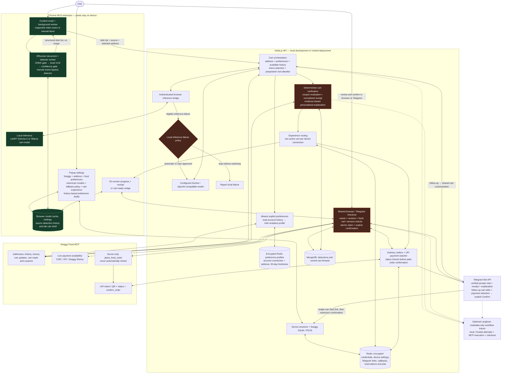

# CraveLens

**See it. Crave it. Get it.** CraveLens is a Chrome extension that recognizes food in supported videos and user-selected page regions on-device, identifies up to eight distinct visible dishes with a local vision-language model, and asks a ReAct agent to prepare a personalized, discount-aware Swiggy cart. It can auto-detect on YouTube, Instagram Reels, and Facebook videos, or use a keyboard-triggered rectangular lasso on any normal webpage. Choose on-screen progress, a small cart-ready nudge, or delivery to a verified Telegram chat. Nothing is ordered until the user explicitly confirms the final cart and payable amount.

[User guide](https://cravelens.nishithp.page/guide/) · [Telegram deployment and setup](TELEGRAM.md)

[](https://youtu.be/CBFwNSKmt8o)

## What it does

1. Samples frames from the active YouTube, Instagram, or Facebook video without uploading them, or captures only the user-selected lasso rectangle from the active tab.
2. Runs the bundled `best_dynamic.onnx` YOLO food detector in an ONNX Runtime Web Worker. Scheduled scans pass only detector-positive frames to the more expensive VLM stage; manual scans bypass this detector gate.
3. Selects a representative, sharp keyframe from a short frame burst.
4. Runs the configured local VLM—Gemini Nano, browser-downloaded Gemma 3n, or an Ollama vision model—to return an `isFood` verdict plus the dish, cuisine, ingredients, confidence, and context.
5. Continues only when the configured VLM returns valid structured JSON, `isFood: true`, and confidence of at least 0.65. Failed, malformed, non-food, and low-confidence responses do not show a craving prompt or create a cart.
6. Records the confirmed dish, frame timestamp or page-selection timestamp, and visual signature in per-source `localStorage` history to suppress repeated scenes, duplicate dishes, unnecessary VLM work, and duplicate carts.
7. Sends only the structured dish description, selected saved-address ID, and source metadata to the Node.js backend.
8. When explicit preferences are absent, reuses an encrypted, account-connection/address-scoped inferred profile or automatically runs the read-only history preference generator before menu discovery. Empty verified history creates no inferred preferences; generation failures stop preparation before cart edits. Runs a LangChain `createAgent()` ReAct loop with authenticated Swiggy MCP tools to search orderable menu items, use explicit preferences and any retrieved order history, build and verify the cart, and evaluate eligible coupons. Fresh history retrieval inside the cart loop remains prompted; cold-start preference generation requires verified history retrieval before cart selection.
9. Delivers the verified receipt through the selected experience: on-screen progress and cart shelf, a dismissible cart-ready nudge, or a linked private Telegram chat. A personalized **Why this cart?** explanation uses recorded run evidence; explicit confirmation precedes checkout with the live available COD, UPI, or Swiggy Money methods.

## Architecture


```mermaid
flowchart TB
  User([User])
  subgraph Chrome["Chrome MV3 extension — pixels stay on device"]
    Popup["Popup settings<br/>Swiggy + address + food preferences<br/>vision/cart models + fallback policy + cart experience<br/>history-based preference drafts"]
    Capture["Content script + background worker<br/>supported video scans or manual lasso"]
    Vision["Offscreen document + detector worker<br/>ONNX gate → local VLM → confidence gate<br/>manual scans bypass detector"]
    Local["Local inference<br/>LiteRT Gemma 4 or Ollama cart model"]
    Cache[("Browser model cache, settings,<br/>source detection history and tab cart shelf")]
    Screen["On-screen progress + receipt<br/>or cart-ready nudge"]
    Capture --> Vision
    Vision -->|"structured dish list, no image"| Capture
    Popup <--> Cache
    Vision <--> Cache
    Screen <--> Cache
  end
  subgraph Server["Node.js API — local development or hosted deployment"]
    Auth["Device sessions + Swiggy OAuth / PKCE"]
    Bridge["Authenticated browser inference bridge"]
    Profiles[("Encrypted Redis preference profiles<br/>account connection + address; 30-day freshness")]
    Bootstrap["Absent explicit preferences<br/>read account history → infer tentative profile"]
    Agent["Cart orchestration<br/>address + preferences + available history<br/>menu selection + preparation tool allowlist"]
    Verify["Deterministic cart verification<br/>coupon evaluation + normalized receipt<br/>evidence-based personalized explanation"]
    Policy{"Local inference failure policy"}
    Hosted["Configured Gemini / OpenAI-compatible model"]
    Deliver["Experience routing<br/>one active cart per device connection"]
    Checkout["Shared browser / Telegram checkout<br/>owner + revision + fresh cart / amount checks<br/>atomic claim + explicit confirmation"]
    Jobs["Delivery outbox + UPI payment watcher<br/>status checks before paid-order confirmation"]
    Redis[("Redis: encrypted credentials, device settings,<br/>Telegram links, callbacks, reservations and jobs")]
    Mongo[("MongoDB: detections and owned cart threads")]
    Agent --> Verify --> Deliver
    Agent <--> Bridge
    Bridge -->|"eligible inference failure"| Policy
    Policy -->|"automatic or user-approved"| Hosted
    Policy -->|"stop without switching"| Stop["Report local failure"]
    Hosted <--> Agent
    Checkout <--> Jobs
    Auth <--> Redis
    Deliver <--> Redis
    Jobs <--> Redis
    Checkout <--> Mongo
    Verify <--> Mongo
  end
  subgraph Swiggy["Swiggy Food MCP"]
    Prep["Addresses, history, menus,<br/>cart updates, cart reads and coupons"]
    Pay["Live payment availability<br/>COD / UPI / Swiggy Money"]
    Order["Server-only place_food_order<br/>never automatically retried"]
    UPI["UPI intent / QR + status + confirm_order"]
  end
  Telegram["Telegram Bot API<br/>verified private chat + receipt + explanation<br/>follow-up cart edits + payment selection → explicit Confirm"]
  Trace["Optional Langfuse: metadata-only workflow traces<br/>local / hosted attempts + MCP execution + checkout"]
  User --> Popup
  User --> Capture
  Popup <--> Auth
  Capture -->|"dish list + source + selected address"| Agent
  Bridge <--> Local
  Agent --> Bootstrap
  Bootstrap <--> Profiles
  Bootstrap <--> Prep
  Agent <--> Prep
  Verify <--> Prep
  Agent -.-> Trace
  Verify -.-> Trace
  Checkout -.-> Trace
  Telegram -.-> Trace
  Deliver --> Screen
  Deliver --> Jobs --> Telegram
  Telegram -->|"single-use Start link, then extension confirmation"| Auth
  User -->|"review and confirm in browser or Telegram"| Checkout
  Screen <--> Checkout
  Telegram <--> Checkout
  Telegram -->|"follow-up → shared cart customization"| Agent
  Checkout <--> Pay
  Checkout <--> Prep
  Checkout --> Order --> UPI
  Jobs <--> UPI
  classDef local fill:#173d2b,stroke:#55c98a,color:#fff
  classDef safety fill:#4a251b,stroke:#ff7043,color:#fff
  class Capture,Vision,Local,Cache local
  class Verify,Checkout,Policy safety
```

### Trust and privacy boundaries

- Video pixels and lasso screenshots remain inside the extension. The server receives the VLM's structured description, not the keyframe or selected image.
- The ReAct agent receives only an allowlist of cart-preparation tools. It cannot call `place_food_order`.
- Order placement happens only after explicit confirmation of the reviewed receipt in the browser or verified Telegram chat. Choosing a payment method does not place an order. Both channels use the same checkout service and atomic submission claim.
- `place_food_order` is never retried automatically because it is not idempotent.
- The payable total is read from the verified Swiggy cart and normalized with item discounts, coupons, taxes, fees, and delivery charges.
- The Builders Club ₹1,000 cart limit is checked before confirmation and again before ordering.

## Repository layout

```text
CraveLens/
├── apps/
│   ├── extension/       Chrome MV3 extension, local models and browser UI
│   ├── server/          Node.js API, OAuth, LangGraph agent and Swiggy adapter
│   └── web/             Vite-powered landing page
├── packages/
│   └── shared/          Shared Zod request and response contracts
├── .env.example         Server configuration template
└── package.json         npm workspace scripts
```

## Prerequisites

- Node.js 20 or newer
- npm
- Chrome or Chromium with WebGPU support
- A Swiggy account supported by the Swiggy MCP server
- Optional: a Gemini or OpenAI-compatible API key for hosted orchestration defaults or approved local fallback
- Optional: MongoDB for persistent detection and orchestration storage
- Redis for device sessions, encrypted credentials, settings, and browser-inference routing

## Local setup

```bash
npm install
cp .env.example .env
npm run build
npm run dev
```

Then:

1. Open `chrome://extensions`.
2. Enable **Developer mode**.
3. Choose **Load unpacked** and select `apps/extension/dist`.
4. Open the CraveLens popup and complete Swiggy sign-in.
5. Select a saved delivery address.
6. Open a supported video page, such as YouTube, Instagram Reels, or Facebook Watch/video, and use **Scan current frame** (`Ctrl+Shift+Y`) to send the current frame directly to the configured VLM, bypassing the scheduled ONNX gate, or allow continuous ONNX-gated scanning.
7. On other webpages, use the same keyboard shortcut to draw a rectangular lasso around visible food. Only the selected area is captured and checked.

During extension development, `npm run dev` watches and rebuilds the extension. Reload the unpacked extension from `chrome://extensions` after a rebuild. Restart the Node process after server changes.

### Local Swiggy OAuth

For local sign-in, start the local server with `npm run dev:local`, reload the
extension, and switch **Server environment** to **Dev** (the Prod toggle is
off). These three values must agree:

```text
Extension API:     http://localhost:8787
PUBLIC_BASE_URL:   http://localhost:8787
Swiggy callback:   http://localhost:8787/api/swiggy/auth/callback
```

Swiggy must allowlist that exact localhost callback as well as the production
callback. The popup deliberately shows **Connect Swiggy** first; clicking it
starts the authorization in a user-initiated browser tab.

### Production: GitHub Pages with a Raspberry Pi server

The landing page may remain on GitHub Pages at `https://cravelens.nishithp.page`.
The companion Cloudflare Worker in `apps/edge-proxy` intercepts `/telegram/webhook`, `/api/*`,
`/socket.io/*`, `/health`, and `/models/*`, then forwards those requests through
an Access-protected Cloudflare Tunnel to the Pi. The exact `/telegram/webhook` route forwards bot updates to the API, preserving Telegram’s secret header and request body. Other Telegram settings/link APIs use the existing `/api/*` route. Redeploy the Worker when updating its routes. Static paths, including `/guide/`, `/robots.txt` and `/sitemap.xml`, continue to GitHub Pages. Follow the deployment instructions in
[`apps/edge-proxy/README.md`](apps/edge-proxy/README.md).

## Local model setup

The YOLO food detector and ONNX Runtime WASM are bundled with the extension. The detector model is located at:

```text
apps/extension/public/models/food-detector/best_dynamic.onnx
```

It accepts a dynamic `[1, 3, 640, 640]` tensor and produces `[1, 5, 8400]` detections. Frames are letterboxed before inference; decoded boxes are mapped back onto supported videos when debug mode is enabled.

Gemma 3n VLM verification does not need a server-installed model: selecting Gemma 3n downloads `gemma-3n-E2B-it-int4-Web.litertlm` directly from Google's Hugging Face repo into the extension's browser cache and runs it locally with WebGPU. For orchestration, selecting LiteRT downloads the chosen supported Gemma 4 text model directly into the browser cache after Settings are saved: E2B (1.9 GB), E4B (2.8 GB), 12B (5.6 GB), 26B A4B (14.7 GB), or 31B (17.9 GB). The browser-downloaded model bytes do not pass through the CraveLens server.

Server-installed Gemma 4 E2B/E4B VLM `.task` artifacts are temporarily hidden from the VLM Settings UI. `apps/server/models` remains available for those optional artifacts when this path is re-enabled. The browser must support WebGPU; first load can take time because the model is large.

### Docker Compose

The repository Compose file runs MongoDB, `redis:8.8.1-alpine`, and the published CraveLens server image. Redis is private to the Compose network, password protected, health checked, and persisted with append-only storage.

After creating `.env`, start the services with:

```bash
docker compose up -d
```

The host directory `./apps/server/models` is mounted read-only at `/app/apps/server/models` in the server container.

## Configuration

| Variable | Required | Default | Purpose |
| --- | --- | --- | --- |
| `PORT` | No | `8787` | Express server port |
| `PUBLIC_BASE_URL` | Yes in production | `http://localhost:8787` | Public origin used for the OAuth callback |
| `LOCAL_MODEL_DIRECTORY` | No | Server model directory | Optional directory for server-hosted model artifacts; normal Gemma 3n/LiteRT downloads are browser-cache based |
| `REDIS_URL` | Yes | `redis://localhost:6379/0` | Redis used for device sessions, encrypted OAuth/BYOK, settings and Socket.IO routing |
| `CREDENTIAL_ENCRYPTION_KEY` | Yes | — | 32-byte hex/base64 AES-256-GCM envelope-encryption key |
| `DEVICE_SESSION_SIGNING_KEY` | Yes | — | Signs 15-minute extension device access tokens |
| `AGENT_MODEL_PROVIDER` | Yes | `gemini` | `gemini` or `openai` |
| `AGENT_MODEL_NAME` | Yes | `gemini-2.5-flash` | Agent model name |
| `AGENT_MODEL_API_KEY` | Yes | — | Agent provider API key |
| `AGENT_MODEL_BASE_URL` | For custom OpenAI-compatible APIs | `https://api.openai.com/v1` | ChatOpenAI base URL |
| `OLLAMA_BASE_URL` | No | `http://localhost:11434` | Default Ollama origin shown to extension users; each device may override it |
| `LANGFUSE_PUBLIC_KEY` | No | — | Enables Langfuse tracing when paired with the secret key |
| `LANGFUSE_SECRET_KEY` | No | — | Enables Langfuse tracing when paired with the public key |
| `LANGFUSE_BASE_URL` | No | `https://cloud.langfuse.com` | Langfuse Cloud region or self-hosted instance |
| `LANGFUSE_TRACING_ENVIRONMENT` | No | `development` | Environment label applied to Langfuse traces |
| `MONGODB_URI` | No | — | Enables persistent storage when set |
| `MONGODB_DATABASE` | No | `cravelens` | MongoDB database name |
| `TELEGRAM_BOT_TOKEN` | For Telegram | — | Server-only BotFather token |
| `TELEGRAM_TRANSPORT` | No | `auto` | `auto`, `polling`, or `webhook` |
| `TELEGRAM_WEBHOOK_SECRET` | For webhook mode | — | At least 32 letters, digits, underscores or hyphens; authenticates updates |
| `SWIGGY_FOOD_MCP_URL` | No | `https://mcp.swiggy.com/food` | Swiggy Food MCP endpoint |
| `SWIGGY_MCP_ACCESS_TOKEN` | No | — | Developer-only fallback; normal users use OAuth |

For OpenAI:

```dotenv
AGENT_MODEL_PROVIDER=openai
AGENT_MODEL_NAME=gpt-4.1-mini
AGENT_MODEL_API_KEY=...
AGENT_MODEL_BASE_URL=https://api.openai.com/v1
```

### Langfuse observability

Langfuse tracing is optional and runs only when both credentials are present:

```dotenv
LANGFUSE_PUBLIC_KEY=pk-lf-...
LANGFUSE_SECRET_KEY=sk-lf-...
LANGFUSE_BASE_URL=https://cloud.langfuse.com
LANGFUSE_TRACING_ENVIRONMENT=development
```

A cart trace starts after the atomic cart reservation and before Swiggy connection, address loading or model selection. It includes direct menu search, preference bootstrap/history generation, agent model attempts and tool execution, deterministic verification, receipt/coupon/payment lookups, explanation generation, persistence and delivery queueing. Follow-up browser requests and shared browser/Telegram checkout operations use the same cart conversation ID as their Langfuse session. Background preference jobs use their own run ID; Telegram cart delivery resumes the cart session in a separate trace. Validation/authorization failures before these workflow entry points, OAuth internals, extension VLM/ONNX inference, database internals and Telegram polling are not end-to-end cart traces.

Every Swiggy tool execution through the shared MCP client has a `swiggy.mcp.<tool>` observation, including direct reads and checkout calls outside the agent. Agent tool execution spans contain these MCP spans; LangChain callbacks separately record agent decisions and model generations. Do not add decision spans to MCP execution counts. Local and hosted provider attempts carry their actual origin/provider/model; the fallback router is a chain, so it does not double-count generation usage. Existing inference repair attempts and fallback approval waits are observable without adding retries or changing approval policy.

All local and hosted traces are metadata-only. A filter before the exporter strips prompts, responses, tool arguments/results, arbitrary metadata, exception text/events, user/device IDs, addresses, chat IDs, credentials, images and payment payloads. It retains opaque conversation/run/stream IDs, operation/tool/provider/model labels, timing, controlled outcomes/error codes, environment and numeric usage/cost counters when reported by the provider. Missing usage is not invented; costs depend on Langfuse model configuration. `LANGFUSE_LOCAL_CONTENT` no longer enables content capture. Existing historical traces are not retroactively scrubbed: review their retention separately.

The server initializes OpenTelemetry at startup and flushes during graceful shutdown. Missing credentials, initialization failures and export errors do not block business execution or retry tools/orders. Abrupt process termination and network/export failure may lose observations; a successful build does not prove ingestion. Verify a real cart session in the configured Langfuse project after deployment. Enabled-path tests exercise the real SDK with an in-memory exporter, including parentage, concurrent session isolation, local-to-hosted fallback, redaction and single-execution safety.

## Swiggy OAuth flow

CraveLens uses OAuth 2.1 with PKCE through the official MCP SDK instead of implementing a custom token exchange in the extension.

1. The popup calls `POST /api/swiggy/auth/start`.
2. The backend performs MCP metadata discovery, dynamic client registration, and PKCE setup.
3. The popup opens the returned Swiggy consent URL.
4. Swiggy redirects to `http://localhost:8787/api/swiggy/auth/callback` during local development.
5. The backend atomically consumes OAuth `state`, completes authorization, and stores the credential encrypted in Redis with the provider expiry.
6. The popup polls the status endpoint and then loads saved addresses.

The extension stores a rotating CraveLens device refresh token and keeps its 15-minute access token in `chrome.storage.session`; it never receives the Swiggy access token. Existing filesystem-backed sessions require a one-time reconnection. A deployed callback uses the fixed HTTPS `PUBLIC_BASE_URL` callback and may require Swiggy allowlisting.

### Local models and Ollama

The extension initiates an authenticated `/inference` WebSocket connection to the server. The server-side `RemoteBrowserChatModel` invokes LiteRT or Ollama through that connection; neither an Ollama endpoint nor a browser model is tunnelled or exposed publicly. The Settings page starts with `OLLAMA_BASE_URL` (default `http://localhost:11434`), lets the user override it per device, and immediately probes `/api/tags` and `/api/show`. A non-default host requires a one-time Chrome host-permission grant when **Test** is clicked. The configured Ollama service must allow this unpacked extension's exact `chrome-extension://<extension-id>` origin, for example `OLLAMA_ORIGINS=chrome-extension://<extension-id>`, before Ollama is restarted. Do not expose an unauthenticated Ollama service to the public internet.

For hosted orchestration, `AGENT_MODEL_PROVIDER` selects the single server default (`gemini` or `openai`). In the extension, choose the matching Google Gemini or OpenAI-compatible entry and leave model, URL, and key blank to use that deployment configuration. A key entered in Settings is encrypted in Redis and takes precedence for that device; the inactive hosted provider requires such a user override. For LiteRT/Ollama cart-model inference failures, the popup offers **Automatically use a hosted model**, **Ask before using a hosted model** (default), or **Stop without switching models**. Automatic fallback or approval sends the run’s model context to the configured hosted provider; it does not upload video frames. In Telegram mode, Ask approval is delivered in the linked chat. Cancellation and an unverified cart do not trigger hosted fallback. Stopping does not undo earlier cart edits.

For managed deployments use a TLS Redis URL and store the encryption/signing keys in the platform secret manager. Rotate an encryption key by decrypting with the old key and re-encrypting each credential before removing it. Local and hosted Langfuse traces are always metadata-only; content capture is disabled.

The popup footer displays the installed extension version directly from `chrome.runtime.getManifest().version`, so it stays aligned with the packaged manifest without a separate version label to maintain.

## Build my preferences

When **Food preferences and routines** is empty, cart preparation automatically runs this same read-only generator before searching menus. The popup shows a readable inferred-preferences card with a tentative label, order coverage, update date and expandable **History & evidence** notes. The saved inferred profile is scoped to the authenticated Swiggy connection and the actual selected delivery address, encrypted in Redis, and reused for up to 30 days. A disconnected/reconnected account clears its profiles. The service records an empty-history check without fabricating preferences and checks it again after 24 hours. History/model/validation failures stop preparation before cart edits; keep Chrome running for local inference and retry after correcting the reported problem. Concurrent requests share a generation through a Redis lock. Existing explicit context always takes priority and is never overwritten. Generated routines require repeated, evidenced order timestamps; past purchases do not establish allergies, permanent dietary restrictions or a spending budget.

After a completed cart response, the extension caches the latest inferred profile per environment. **Saved inferred preferences** appears below the empty editor only for its delivery address; you can enter and save explicit preferences to override it. Disconnecting Swiggy or starting a new connection clears that local display cache. The browser cache can remain until cleared; it is only for display, while the server checks account/address scope and profile freshness before reuse. Checkout still requires explicit review and confirmation.

In **Personal context**, click the sparkle inside **Food preferences and routines**. Select a saved **Delivery address** first; its ID is required by Swiggy for history retrieval. A read-only workflow targets the latest seven orders from the connected account. It walks Swiggy’s newest-first history and fetches details, checking the returned order ID but performing no additional delivery-address ID checks. History may include orders from other addresses. Structured JSON and Swiggy’s text receipt format are supported; text parsing extracts only item descriptions and available order timestamps, omitting delivery, contact, payment and image URL sections. Every `get_food_orders` request explicitly sends `{ addressId: selectedAddressId, activeOnly: false, orderCount: 15 }`; the address is a required upstream argument, not a local history filter. Pagination follows only the live tool schema (bounded to 100 inspected orders and 20 pages). Progress and draft notes report the actual retrieved count and account-wide scope. Only bounded, sanitized details reach the selected cart model, which preserves explicit constraints and labels tentative patterns. No cart preparation or checkout tools are exposed to this agent.

The popup shows actual progress updates from an authenticated, device-owned Redis job, polled every 500 ms while running, with a rotating glow that respects reduced-motion preferences. Local inference and the saved hosted-fallback policy apply. Pending approval appears in the popup, or Telegram when configured. Runs have a five-minute model deadline and ten-minute result retention; reopening the popup can resume the run’s progress or draft. A server restart can interrupt unfinished work. Failures identify the connection, history retrieval, model generation or draft-validation stage; your original context stays unchanged. Server diagnostics include the run ID, stage and error category without logging history or credentials.

The original text stays in the editor. The draft card uses the same typography and expandable **History & evidence** notes as saved inferred preferences, with order coverage and a **Not saved yet** label. **Use suggestion** saves the reviewed draft; **Keep original** discards the draft. Suggestions may reflect incomplete history and must be reviewed, especially allergies, dietary restrictions, routines and budgets. This explicit history review is separate from the cart agent’s optional history retrieval.

Unsupported details or mismatched order IDs are excluded. If no details can be read, **Build my preferences** reports a history-reading failure without offering an unchanged draft as a suggestion. Empty history also finishes without a suggestion. Cold-start carts continue without inferred preferences when history cannot be read; that failed attempt is not cached as empty history. Partial history can still produce a tentative profile with coverage notes.

## Multiple dishes in a frame

The local vision contract retains the primary `dish`, `description`, `cuisine`, `ingredients`, `confidence` and `context` fields and adds `dishes[]` (up to eight entries), each with its own dish name, description, cuisine, ingredients and confidence. The prompt asks for only the main prepared dishes in focus, excluding garnishes, condiments, dips, small sides, drinks, isolated ingredients and background food; it does not require eight dishes. Missing per-dish cuisine labels default to `unknown` in the shared contract used by the extension and API, preserving the detected dish list without guessing cuisine. Legacy single-dish model responses remain accepted with an empty list. Malformed lists fail validation; the model must not split ingredients or duplicate portions into separate dishes. The vision context budget is 4,096 tokens with 1,536 reserved for structured output; recognition still depends on the local model and hardware. Only this structured result and source metadata reach the server; pixels remain local.

The cart agent considers all dishes and their uncertainty while preparing one coherent cart from a single restaurant, guided by preferences and availability. This does not guarantee every depicted dish is included or that multiple restaurants can be combined. Follow-up edits retain the original dish list. Deduplication includes the dish list, ingredient evidence, selected address and explicit context; confidence fluctuations alone do not create a new cart. Local and hosted agents have no per-tool search quotas or duplicate-query rejection. There is no cumulative inference-request, model-call or graph-step cap. The 180-second cart-loop deadline and invalid-argument/missing-tool repair safeguards still apply.

## Cart-agent workflow

Cart preparation combines an LLM-driven tool loop with server-side verification:

1. Validate the selected saved address and reserve one active cart for the device connection.
2. If explicit context is absent, retrieve/reuse the scoped inferred preference profile; cold starts run the account-history generator first. Provide the context, its explicit/inferred provenance, profile age/coverage, the complete detected dish list and observation time. Fresh history reads inside the cart loop remain prompted rather than guaranteed on every run.
3. Search orderable items and suitable restaurants, selecting exact item IDs and variant/add-on configurations. The preparation agent cannot place orders.
4. Update the cart and deterministically re-read it to verify the requested contents. Bounded repair handles invalid tool arguments and missing required tool calls; exhaustion returns an error.
5. Evaluate eligible coupons and refresh the verified receipt. Coupon availability and payment restrictions come from Swiggy; savings are not guaranteed.
6. Produce a personalized explanation as spaced bullet points from the recorded selection evidence, explicit preferences, history when fetched, and verified cart. If explanation generation fails, return an evidence-based fallback; do not invent preferences or expose hidden model reasoning.
7. Deliver the receipt through the selected browser or Telegram experience.
8. On explicit confirmation, recheck ownership, receipt revision, actual items, payable amount, payment availability and the cart limit before claiming checkout atomically.

COD and Swiggy Money use the shared checkout path. UPI returns a payment handoff; payment status is checked before finalizing a paid order. Both interfaces use the same pending-payment cancellation service. Telegram offers **Cancel payment process**; live payment status is checked first, and paid or uncertain outcomes cannot be reported as cancelled. Stopping tracks only CraveLens’s workflow, not a UPI transfer or refund. An uncertain placement or payment is held for review instead of automatically submitting another order.

### Quiet modes and Telegram

In **Cart experience**, select **Show progress on screen**, **Notify me when my cart is ready**, or **Send my cart to Telegram**, then Save. Quiet modes suppress progress overlays; the nudge opens the regular receipt. Telegram delivers an available product photo followed by an HTML-formatted verified receipt, explanation and payment controls to a linked private chat. Long receipts are split safely, with checkout controls on the final message; rejected photos fall back to the receipt alone. **Silent Telegram messages** controls notification sound. Send a private follow-up (up to 500 characters) or reply to the receipt/product photo to update the current cart through the same checkpointed, verified customization service used by the browser. Updated receipts require a fresh confirmation; old buttons are invalidated. Incoming messages are deduplicated and queued so webhook processing does not wait for model inference. Interrupted updates are not automatically replayed.

Telegram linking requires a five-minute, single-use bot Start link and confirmation of the displayed account in the extension. Bot tokens stay server-side. Short-lived callback tokens are bound to the cart owner and receipt revision; disconnect revokes old-button access. Telegram receives cart/address/payment details, never video frames. The browser must remain running for local inference.

Set `TELEGRAM_BOT_TOKEN` in `.env`. `TELEGRAM_TRANSPORT=auto` uses polling with an HTTP local origin and a secret-authenticated webhook with an HTTPS `PUBLIC_BASE_URL`; webhook mode requires `TELEGRAM_WEBHOOK_SECRET`. The production proxy must forward `/telegram/webhook` to the API. Use separate development and production bots. See [TELEGRAM.md](TELEGRAM.md) for setup, transport, persistence and checkout details.

One active cart is permitted per authenticated extension connection, not across all devices using the same Swiggy account. Delivery jobs retry while the cart remains valid. Uncertain checkout remains blocked until its reservation expires; check Swiggy before preparing another cart.

## API overview

| Method | Endpoint | Description |
| --- | --- | --- |
| `GET` | `/health` | Service health check |
| `GET` | `/api/local-model/status` | Optional server-hosted local model artifact availability |
| `POST` | `/api/device/session` | Bootstrap a signed device session |
| `POST` | `/api/device/session/refresh` | Rotate a device refresh token |
| `GET` | `/models/:file` | Optional static server-hosted model artifact endpoint; hidden from the normal VLM Settings path |
| `POST` | `/api/swiggy/auth/start` | Start OAuth/PKCE authorization |
| `GET` | `/api/swiggy/auth/status` | Poll authorization state for the authenticated device |
| `GET` | `/api/swiggy/auth/callback` | OAuth redirect callback |
| `GET` | `/api/swiggy/addresses` | Load normalized saved addresses |
| `GET/PUT` | `/api/model-settings` | Read/update VLM and orchestration providers without returning secrets |
| `GET` | `/api/videos/:videoId/detections` | Read cached source detections |
| `POST` | `/api/orchestrate` | Build and verify a personalized cart |
| `POST` | `/api/orchestrate/:threadId/customize` | Continue the cart-agent conversation with a free-form instruction |
| `GET` | `/api/orchestrate/:threadId/menu` | Browse or search the prepared cart's restaurant menu |
| `POST` | `/api/orchestrate/:threadId/cart` | Add, remove, or change the quantity of verified cart items |
| `POST` | `/api/orchestrate/:threadId/coupon` | Apply a selected eligible coupon and refresh the receipt |
| `POST` | `/api/orchestrate/:threadId/decision` | Reject a cart or approve it with `COD`/`UPI`/`SwiggyPay` (Swiggy Money) |
| `GET` | `/api/orchestrate/:threadId/payment-status` | Poll a pending UPI payment |
| `POST` | `/api/orchestrate/:threadId/cancel-payment` | Stop a still-pending UPI flow after re-checking its status |
| `POST` | `/api/orchestrate/:threadId/confirm-payment` | Finalize a successfully paid UPI order |
| `POST` | `/api/videos/:videoId/detections` | Save a detection window |
| `POST` | `/api/orchestrate/:runId/fallback` | Approve/reject a pending hosted-model fallback |
| `POST` | `/api/preferences/build` | Start or resume a read-only preference-drafting job |
| `GET` | `/api/preferences/build/:runId` | Read device-owned progress, fallback state and draft |
| `GET/PUT` | `/api/cart-experience` | Read/save delivery mode and Telegram notification preference |
| `GET` | `/api/telegram` | Read bot availability and account-link state |
| `POST` | `/api/telegram/connect` | Issue a single-use bot Start link |
| `POST` | `/api/telegram/confirm` | Confirm the account that opened the Start link |
| `DELETE` | `/api/telegram` | Disconnect Telegram and revoke button access |
| `POST` | `/telegram/webhook` | Receive Telegram updates with the configured secret header |

Device-facing authenticated APIs use a short-lived `Authorization: Bearer <device-access-token>` header. Redis stores only hashes of rotating refresh tokens. The Telegram webhook uses its separate secret-header check, not a device bearer token.

## Storage

With `MONGODB_URI` configured, CraveLens stores:

- one cache document per supported source ID, with five-second fuzzy detection deduplication;
- owned orchestration threads with a 24-hour TTL index, including Telegram message references and short-lived pending UPI references while a payment is in progress.

Without MongoDB, both server stores fall back to process memory and are cleared when the server restarts.

The browser additionally stores the following per supported video or selected page source in `localStorage`:

- VLM-confirmed dish names, normalized deduplication keys, confidence, and frame timestamps;
- compact frame histogram signatures used to avoid repeated VLM verification of the same scene.

Prepared cart suggestions, their ready/ordered state, and whether the source-aware cart shelf is hidden or visible are stored in per-tab `sessionStorage`. Cart suggestions include a 10-minute `expiresAt`; expired suggestions are removed from the client shelf and rejected by the server before order placement.

Device-session tokens, selected address, extension preferences, model settings, detector sensitivity, keyboard shortcut behavior, per-site auto-detection settings, and debug setting are cached in extension storage for background and content-script reads. Swiggy OAuth credentials and BYOK provider keys stay server-side, encrypted in Redis.

Redis also persists Telegram account links, 15-minute opaque callback tokens, active-cart reservations, delivery jobs, payment-watch jobs and polling offsets. Durable MongoDB and Redis are required to retain these flows across production restarts; memory-backed application stores are not persistent.

A successful local identification can still return `ACTIVE_CART_PENDING` if another cart is being prepared or awaiting review. The service now publishes a pause event and the on-screen flow shows the reason instead of silently dismissing progress. For an owned, unexpired cart awaiting confirmation, **Review existing cart** reopens its receipt on the current page so it can be reviewed or rejected. Pending checkout/payment states are not reopened as new orderable receipts. Review or reject the existing cart before building another; paused requests are not retained in the short duplicate-request cache. A failed progress WebSocket no longer prevents the cart HTTP request, and progress connections are closed when preparation succeeds or fails. Quiet automatic scans keep failures in debug/console state; manual selection scans show the outcome.

## Debugging

Enable **Debug overlay** in the popup. The source-aware overlay reports:

- active source ID and timestamp;
- ONNX detector scheduling and inference latency;
- detector boxes, labels, and confidence scores;
- temporary bounding boxes drawn over supported videos and removed when stale, paused, seeking, ended, or disabled;
- Configured VLM food-presence verdict, context and inference time, plus a compact 300 px panel with a scrollable list showing one detected dish at a time (96 px maximum; a single result shrinks to its content) with its own confidence, cuisine, description and visible ingredients; low-confidence entries are marked and legacy single-dish results are labelled;
- confirmed-food history and prepared-cart counts;
- worker, model, messaging, and orchestration errors.

Useful checks:

```bash
curl http://localhost:8787/health
npm test
npm run typecheck
```

Agent progress is logged by the server as `[agent:<run-id>]`, including tool start/completion, duration, and sanitized arguments.

While orchestration is running, the extension also opens a Socket.IO WebSocket and subscribes to a UUID-scoped room before sending the cart request. The server streams sanitized lifecycle and MCP tool events to that room, allowing the loading card to show live address, history, menu, cart, coupon, and verification progress. The generated-cart popup accepts follow-up instructions and sends them through the same application thread UUID, which is also used as LangGraph's checkpointed `thread_id`; the verified receipt is then refreshed in place. The socket closes when the cart is ready or the run fails; cart confirmation continues to use the explicit HTTP decision endpoint.

## Scripts

| Command | Description |
| --- | --- |
| `npm run dev` | Watch the server and extension |
| `npm run build` | Build/check shared, server, and extension workspaces |
| `npm run dev:web` | Run the landing page |
| `npm run build:web` | Build the landing page |
| `npm test` | Run server, extension and edge-proxy tests in each workspace’s `tests/` folder |
| `npm run typecheck` | Syntax/type checks across workspaces |

Tests live separately from production source in `apps/server/tests`, `apps/extension/tests` and `apps/edge-proxy/tests`. Run an individual workspace suite with `npm test -w @cravelens/server`, `@cravelens/extension` or `@cravelens/edge-proxy`.

## Current constraints

- Food recognition quality depends on the visible frame and local model confidence.
- The ONNX detector is a preliminary gate; only configured-VLM-confirmed food at confidence 0.65 or higher can create a craving prompt or cart.
- Auto-detection currently targets YouTube, Instagram Reels, and Facebook Watch/video pages. Other webpages use the keyboard-triggered lasso selector.
- Per-source history is local to the current browser origin/profile and can be cleared with browser site data.
- Browser-local VLM and LiteRT inference require a capable WebGPU device and sufficient memory; Ollama models require a reachable local Ollama service.
- Swiggy MCP client availability and account eligibility are controlled by Swiggy.
- Checkout shows live COD, UPI and explicitly available Swiggy Money methods returned by Swiggy. Money submits `SwiggyPay` and requires sufficient eligible wallet availability. UPI orders use Swiggy's QR handoff, payment-status polling, optional mid-flow cancellation, and one-time confirmation flow; availability remains account/cart dependent.
- Telegram requires a configured, reachable bot and an account verified through the extension. Blocking the bot or stopping local inference can prevent preparation/delivery.
- When explicit preferences are absent, cold-start generation reads order-ID-checked account history; saved profiles can be reused without fresh history reads. Fresh history retrieval inside the cart loop is not guaranteed. Personalized explanations describe recorded evidence, not hidden chain of thought.
- This is an experimental ordering assistant; always review the restaurant, address, items, dietary implications, and final amount before confirming.

## Website documentation and search discovery

The public [feature guide](https://cravelens.nishithp.page/guide/) is maintained in `apps/web/guide/index.html` and linked from the landing page navigation and footer. Vite builds it as a static page with a canonical URL and `index, follow` metadata. `apps/web/public/sitemap.xml` lists the home, guide, privacy and terms pages; `apps/web/public/robots.txt` permits crawling and points to that sitemap. Run `npm run build:web` and deploy `apps/web/dist` to publish updates. These settings make the pages discoverable; actual search-engine indexing depends on deployment and the crawler.

### Guide screenshots

The public feature guide includes real Chrome screenshots for Swiggy connection, detection controls, manual scan/cart progress, the AI preference editor and live hosted-fallback approval, vision-model selection, cart-model readiness, hosted-fallback policy, connected Telegram controls, cart-delivery choices, local-AI setup, a verified cart receipt, a bullet-point explanation excerpt, live payment choices, and cropped Telegram receipt/cart-edit messages with private details censored. Assets live in `apps/web/public/guide/screenshots/`; each is placed beside its feature instructions with descriptive alt text, a caption and a high-contrast enlargement hint. Clicking a screenshot opens an accessible image modal with zoom, Close, backdrop dismissal and Escape support; closing restores focus to the screenshot. The full-size image link remains available when JavaScript is disabled. Refresh captures when the corresponding UI changes and exclude personal context and credentials. Mask delivery addresses and other private details before adding any real receipt capture to the public guide. Captures show actual product states; the permission screen is explicitly identified as an unfinished preference run. The manual-scan image records real food identification and preparation progress, not a completed checkout. Never create a paid order solely to obtain documentation screenshots.

The landing page, guide, privacy policy, terms and admin dashboard share one theme controller and include a compact **Theme** control with **System**, **Light** and **Dark**. System is the default and follows OS changes. An explicit selection is saved locally in the browser and shared across all pages and tabs on the same origin. No account preference or telemetry request is created.

## Private admin dashboard

The server serves the admin console at `/admin/` and its read-only data endpoint at `GET /api/admin/summary?days=7|30|90`. The edge proxy routes both through the existing public hostname and Tunnel. Admin files are bundled with the server Docker image; they are not part of the GitHub Pages website, public navigation, sitemap or extension bundle. Both the Worker and server validate a human Cloudflare Access JWT (RS256, issuer, audience, expiry, subject and allowlisted email). The Worker preserves the validated human assertion in a separate header because origin Access uses the existing service-token application. Supplied forwarding/identity headers are stripped; missing settings and forged assertions fail closed. Admin responses are `no-store`, `noindex` and use a restrictive CSP. There are no customer/order mutation actions.

Create one self-hosted Cloudflare Access application with public destinations `cravelens.nishithp.page/admin` and `cravelens.nishithp.page/api/admin`, including their subpaths, and an Allow policy limited to your admin email addresses. Use one application/audience for both destinations so same-origin dashboard fetches share the login session. Do not add a Bypass or public/service-token Allow policy to this application; retain the separate service-token-only policy on the Tunnel origin. The public landing page and extension API paths must remain outside the admin application. Set these matching values on the server and Worker:

- `ADMIN_ACCESS_TEAM_DOMAIN`: `https://<team>.cloudflareaccess.com`.
- `ADMIN_ACCESS_AUDIENCE`: the admin application's Audience (AUD) tag, not the origin service-token application's audience.
- `ADMIN_EMAILS`: comma-separated allowed human admin email addresses.

See [edge deployment instructions](apps/edge-proxy/README.md). This repository configuration does not create Access policies or deploy the Worker/server. After deployment, test `/admin`, `/admin/`, an admin asset and `/api/admin/summary` while signed out and as a disallowed user; verify login/denial, then verify the allowed admin can load the UI and data. Direct origin and forged-header requests must be denied. No analytics credentials are exposed to the browser.

### Local admin dashboard

Run `npm run dev:admin` and open `http://127.0.0.1:8032/admin/`. This standalone, read-only dashboard uses the same `MONGODB_URI`, `MONGODB_DATABASE` and Langfuse configuration from the repository `.env` as the server. It reads real analytics collections without creating indexes, inserting coverage records or modifying customer/order data. Choose `ADMIN_LOCAL_PORT` to change the port.

The local dashboard binds exclusively to IPv4 loopback, validates the Host header, rejects cross-site requests and exposes only admin assets and the read-only summary. It requires no Cloudflare login on your own machine. The production server continues to require Cloudflare Access; no environment switch bypasses production authorization. Do not publish this local listener through a tunnel. A missing or unreachable MongoDB returns an explicit unavailable state; there is no mock or memory-backed analytics fallback. Database collection begins when the instrumented API runs; the dashboard does not backfill older orders.

### Metric sources and boundaries

| Metric | Source and meaning |
|---|---|
| Registered / active devices | Durable MongoDB ledger of observed extension registrations and authenticated activity; these are not unique people or Swiggy accounts. Reinstalling registers a new device. |
| Confirmed orders / payable value | One durable record per cart conversation after the provider-confirmed `ordered` state, including shared browser/Telegram checkout. Pending, declined and uncertain payments do not count. Payable value is not CraveLens revenue. |
| Top models / local vs hosted / model failures | Server-side GET queries to Langfuse observations. Only actual provider generations are counted; the fallback router is excluded. Failed attempts count even when a later retry succeeds. Vision-only scans are not represented. |
| Hybrid calls / hybrid traces | Hosted generations within a Langfuse trace that also contains a local generation, and the number of such traces. Local vision followed by hosted planning alone is not hybrid. |
| Dish frequency | Distinct model-generated labels in structured detections already submitted for a reserved cart-preparation request; includes preparation failures. It does not track all local scans or unique meals. Duplicate joins do not add counts. |
| Failure / cart readiness / activity | HTTP 5xx records and preparation outcomes in MongoDB, plus failed top-level workflows and daily observation counts in Langfuse. Errors can overlap across layers; do not add them together. |

There are **no new extension POST requests**, screenshot uploads or Langfuse content capture. Existing requests and checkout transitions feed aggregate analytics without prompts, preference text, addresses, contacts, page URLs or payment payloads. Device ledger keys are HMACs. Event counters have 90-day retention; registrations and confirmed-order ledgers persist. Collection begins when this server version starts; older expired carts/registrations are not backfilled. Writes are best effort and never retry shopping actions; the dashboard shows missed writes since the server restart. Provision MongoDB storage and backups: a missing database shows unavailable data, not simulated totals. Compose now uses `mongo_data`; **back up and migrate an existing container's database before adopting this volume**, since attaching a fresh volume does not copy its old container filesystem.

Langfuse is read server-side using existing project credentials and the configured tracing environment; results are cached for 60 seconds. The v2 observations API supports field selection, omitting input/output. Older instances fall back to paginated v1 observations; any input/output and arbitrary metadata in those responses are discarded on the server and never returned to the dashboard. Reads are capped at 10,000 observations per reporting window; hitting the cap explicitly marks the dashboard as a partial sample/lower bounds. API/configuration failures show unavailable model metrics instead of zero usage. Langfuse history follows project retention and exporter delivery; it is not an accounting ledger. Charts use Asia/Kolkata dates. Both themes use the original checkpoint’s brand orange (`#ff5b38`) for primary controls and accents, with white button labels and a darker orange hover state. The canonical light/dark palette is `packages/shared/static/theme-colors.css`, loaded by landing, guide, privacy, terms and admin. Admin chart/control aliases reference these same tokens; page CSS contains layout rather than separate palettes. Landing-page inline links and text actions use brand orange and persistent underlines, cross-fading to a wavy underline on hover or keyboard focus. Reduced motion disables the transition. Landing scripts keep installation-dialog handling separate from the existing cart illustration interaction; current header/footer and reveal behavior live in shared assets. Footer navigation retains its plain muted links, with orange hover/focus states. Shared component styles (`site-ui.css`) keep primary/secondary buttons, focus rings, reading text, cards and form controls consistent across light/dark public pages and admin. Decorative coral/lime illustrations and the official store badge retain their intended contrast. The pre-footer installation banner preserves the original checkpoint’s coral background, white headline/button, lime kicker and cream food tiles in both themes. Shared motion assets provide once-per-view section entrances, gentle card staggering, navigation and social hover transitions, menu and dialog entrances, and theme color transitions. Content remains visible without JavaScript, and the operating system’s reduced-motion preference disables animation, transitions and smooth scrolling, including existing landing-page loops. Live admin metric cards use the same entrances when loaded. The guide, privacy and terms “On this page” navigation tracks the current reading section using IntersectionObserver and animation-frame-coalesced scroll updates, with accessible `aria-current="location"` highlighting using a soft theme-specific coral tint and border shared with hover/focus states, page-bottom handling and internal TOC scrolling on long guides. All pages render a shared header with brand navigation, installation link, accessible mobile menu and compact icon-only theme control. Theme names remain available to screen readers and hover tooltips. The footer social icons retain their circular outlined design and filled hover state. All pages also render the same branded footer template (`packages/shared/static/site-footer.html`) with Home, User guide, Privacy, Terms, support and social links; Vite injects it into public HTML and the server injects it into the protected admin page. Admin analytics notes remain above it. The public Vite build and protected admin routes use the same asset inventory in `packages/shared/src/site-assets.js`. Shared theme assets live in `packages/shared/static/`; Vite serves/bundles them for the public site and the protected server routes serve the same files for admin. The brand-themed admin UI serves Manrope and DM Sans locally and uses self-hosted Chart.js, with hover values, clickable legends, a seven-day activity zoom/reset, searchable dish graphs and accessible chart-data tables. No charting CDN or additional telemetry requests are used. CSV exports contain only the displayed aggregates and protect against spreadsheet formula injection.

The public landing page retains its original Builders Club integration hero badge and displays the official “Powered by Swiggy” attribution in the final “How it works” step. The shared footer displays “Powered by Swiggy” on the landing, guide, privacy, terms and admin pages. The landing page’s final-step banner is a compact link to `https://www.swiggy.com/`, opening in a new tab. The unmodified full-color logo is self-hosted in `packages/shared/static/swiggy-logo.png`, sourced from [Swiggy’s official corporate website header](https://www.swiggy.com/corporate/wp-content/uploads/unlimited_elements/Swiggy-newsroom-logo.png). It retains its original proportions and color in both themes without a third-party image request.

### Admin assets, Access sessions and CSP troubleshooting

The public admin application and the Tunnel origin use different Access audiences. Admin requests forward the verified human assertion in `X-CraveLens-Admin-Assertion` and authenticate the Tunnel with the Worker service-token headers. The proxy removes browser cookies before this origin hop and strips origin `Set-Cookie` responses so an origin token cannot overwrite the public human Access session. An origin Access login redirect returns a diagnostic HTTP 503 instead of redirecting scripts, styles or images into a login page. Admin responses use `no-store, no-transform`; scripts opt out of Rocket Loader. The strict same-origin CSP remains in place.

If the HTML loads but styles/scripts redirect to `*.cloudflareaccess.com`, inspect the failing request's redirect chain. Keep `/admin` (including subpaths) and `/api/admin` in the same human Access application/AUD; avoid narrower applications overriding asset paths. Disable the Cookie Path Attribute for that multi-path application so its session covers both paths. Keep the origin application restricted to a Service Auth policy for the configured Worker token. After correcting policies and deploying this patch, sign out and sign in again to replace any incorrect Access cookie. Do not add Access login domains or `unsafe-inline` to the admin CSP to hide authentication failures.

Inline scripts are not present in the admin source. If they appear in the served HTML, check Cloudflare tag injection (Zaraz/Google tag gateway), Rocket Loader and browser extensions. Exclude `/admin` and `/admin/*` from tag injection and content optimization; do not disable Access or weaken the admin CSP. A signed-in admin should receive same-origin assets with HTTP 200, their proper MIME types and no login redirects. Tests do not verify deployed Cloudflare policies.
